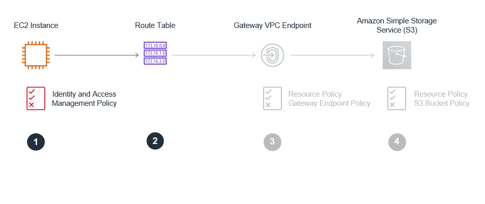
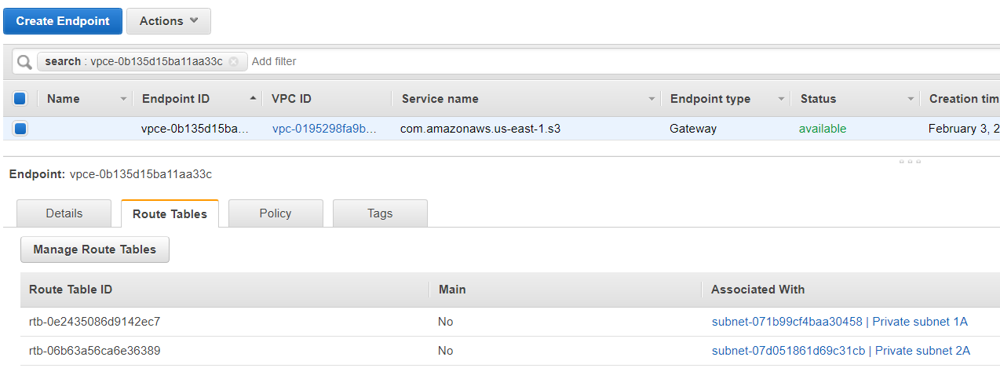
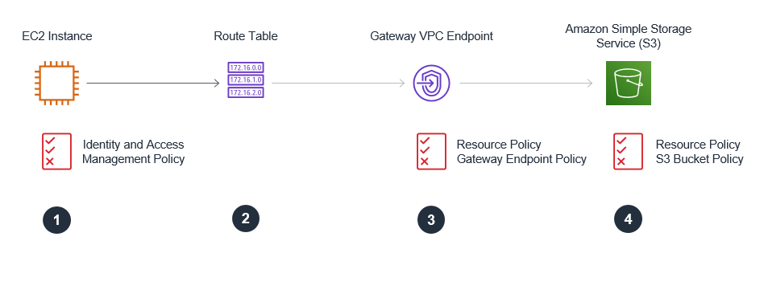

Welcome to the VPC Endpoints Lab!!  The lab is broken into 4 parts during which you will build and verify Gateway and Interface Endpoints.

 

# Build - Gateway Endpoint

You will now examine/update configurations to control access to resources and ensure data to S3 is transmitted on private network segments via an S3 Gateway VPC Endpoint

## Securing Access to the S3 Bucket using a Gateway Endpoint - Overview

 

* **Part 1. Gateway Endpoint - IAM Roles**.  The EC2 instances will use an IAM Role with associated IAM policies which provide permissions to execute API calls against S3.  [See IAM roles for EC2 instances for more information.](https://aws.amazon.com/blogs/aws/iam-roles-for-ec2-instances-simplified-secure-access-to-aws-service-apis-from-ec2/)  
* **Part 2. Gateway Endpoint - Route Tables**.  Routes to the gateway endpoint are placed in the route tables for the private subnets only.  API calls issued from the Cloud9 instance (on the public subnet) will use a route table without an entry that routes traffic to the S3 gateway endpoint.  Consequently, traffic destined for S3 IP addresses that originates on the Cloud9 instance will exit the VPC via the Internet Gateway and traverse the Internet.  API calls issued from the sales application and report engine E2 instances (on the private subnet) will use a route table entry that routes traffic to the gateway endpoint to access S3.
* **Part 3. Gateway Endpoint – Gateway Endpoint Resource Policy**.  You will use a gateway endpoint policy to restrict which S3 buckets can be accessed via the gateway.   
* **Part 4. Gateway Endpoint – S3 Bucket Resource Policy**.  You will use a resource policy (an S3 bucket policy) to requirethat all s3:PutObject API calls (used to write data) occur via the Gateway VPC Endpoint.  This will ensure that the data written to this bucket occurs across a private network segment.   

## Part 1: Gateway Endpoint - IAM Roles

You will now review the IAM policies in use by the lab EC2 instances  

 


The Sales App IAM Role and Policy

1.	Access the salesapp role at the following URL: 

https://console.aws.amazon.com/iam/home?region=us-east-1#/roles  

The role will be named with the cloudFormation stack name, followed by the region it was created in, followed by the string 'salesapp-role'.

2.	Expand the attached policies to review permissions.  Notice:

* The salesapp role has read and write access to both the restricted and unrestricted buckets.   It will use the "s3:PutObject" API call to write data into the restricted S3 bucket. 
* The salesapp role has permissions on the SQS queue, including read and write access.  It will use the "sqs:SendMessage" API call to write a message on the Queue and indicate data for the sales report has been written into the restricted S3 bucket.

3.	Review the trust policy by clicking on the Trust tab.  Notice that the identity provider(s) ec2.amazonaws.com is a trusted entity.  This trust policy allows the sales app EC2 instance to use the role.

The Reports Engine IAM Role and Policy

1.	Access the reportsengine role at the following URL: 

https://console.aws.amazon.com/iam/home?region=us-east-1#/roles

The role will be named with the cloudFormation stack name, followed by the region it was created in, followed by the string 'reportsengine-role'.

2.	Expand the attached policies to review permissions.  Notice:
	
* The reportsengine role has read and write access to both the restricted and unrestricted buckets.  It will use the "s3:GetObject" API call to read data from the restricted S3 bucket. 
* The reportengine has permissions on the SQS queue, including the ability to read and delete SQS messages from the SQS Queue.  It will use the "sqs:ReceiveMessage" API call in order to retrieves messages from the specified queue. The messages will contain the name of the data file from which the report must be created.  The reportengine will use the "sqs:DeleteMessage" API call in order to delete messages once report generation is complete.    

3.	Review the trust policy by clicking on the Trust tab.  Notice that the identity provider(s) ec2.amazonaws.com is a trusted entity.  This trust policy allows the reportsengine EC2 instance to use the role

## Part 2: Gateway Endpoint - Route Tables

You will now review the Route Tables in use by the lab EC2 instances

 

1.  Collect the output values from your CloudFormation stack for PrivateSubnet1ARouteTable and PrivateSubnet2ARouteTable.  These are the route tables associated to your private subnets and affect the routing behavior of your EC2 instances; Sales App and Reports Engine.
2.  Access the Route table screen in the VPC dashboard in the AWS console at the following URL: https://us-east-1.console.aws.amazon.com/vpc/home?region=us-east-1#RouteTables:sort=routeTableId
3.  Highlight one of the route tables and examine the route table entries.  Note that a prefix list (format pl-xxx) entry has been populated in the route table and its target is the gateway vpc endpoint.  This entry is automatically populated by AWS when a gateway endpoint is created and associated with a subnet. 

 

## Part 3: Gateway Endpoint – Gateway Endpoint Resource Policy

You will now configure the Gateway Endpoint Resource Policy restricting which S3 buckets can be accessed via the gateway endpoint

 

1.	Access the Endpoints screen in the VPC dashboard in the AWS console: https://us-east-1.console.aws.amazon.com/vpc/home?region=us-east-1#Endpoints:sort=vpcEndpointId
2.	Refer to the collected output values from your CloudFormation.  Note the value of the “S3VPCGatewayEndpoint” output.  This is your VPC Gateway Endpoint ID.
3.	Select your S3 Gateway Endpoint ID in the upper pane of the AWS console.  Details for the endpoint are presented in the lower pane.  Click on the Policy tab.  Click “Edit Policy” to edit the policy.  Click the custom radio button so that you can enter a custom policy.

 

Resource policy - Gateway Endpoint policy template/example    

``` json
{
  "Statement": [
    {
      "Sid": "Access-to-specific-bucket-only",
      "Principal": "*",
      "Action": [
        "s3:GetObject",
        "s3:PutObject"
      ],
      "Effect": "Allow",
      "Resource": ["arn:aws:s3:::examplerestrictedbucketname",
                   "arn:aws:s3:::examplerestrictedbucketname/*"]
    }
  ]
}	
```

**Important**:  For gateway endpoints only, you cannot limit the principal to a specific IAM role or user. We specify "*" to grant access to all IAM roles and users. For gateway endpoints only, if you specify the principal in the format "AWS":"AWS-account-ID" or "AWS":"arn:aws:iam::AWS-account-ID:root", access is granted to the AWS account root user only, and not all IAM users and roles for the account. (Ref:  https://docs.aws.amazon.com/vpc/latest/userguide/vpc-endpoints-access.html)


Using the endpoint policy template/example above, update the endpoint policy:

5.	Refer to the collected output values from your CloudFormation.  Copy/paste the value of the “RestrictedS3BucketName” output and use it to replace the value of examplerestrictedbucketname in the template/example above and save the custom policy.

  

## Part 4: Gateway Endpoint – S3 Bucket Resource Policy 

You will now configure the S3 Bucket Policy restricting use of the S3 bucket resource

 

Update the S3 Bucket policy in your lab (a template/example is provided below):

1.	Refer to the collected output values from your CloudFormation.  Copy/paste the value of the “RestrictedS3BucketPermsURL” output into a browser to review the permissions on the S3 bucket.  From the permissions tab, click on bucket policy.
2.	Refer to the collected output values from your CloudFormation.  Copy/paste the value of the “RestrictedS3BucketName” output 
3.	Replace the placeholder bucket name “examplerestrictedbucketname” in the template/example with the value of “RestrictedS3BucketName” collected from the CloudFormation outputs
4.	Refer to the collected output values from your CloudFormation.  Copy/paste the value of the “S3VPCGatewayEndpoint” output 
5.	Replace the placeholder “vpce-vpceid” string in the template/example with the value of “S3VPCGatewayEndpoint” collected from the CloudFormation outputs (format will be vpce-xxxxx)
6.	Having updated the example policy (below) with values for your specific resources, add the bucket policy to the S3 bucket.   For additional instructions/clarifications to update the bucket policy see “How do I add an S3 bucket policy?” 


Resource policy - S3 bucket policy template/example 

``` json
 {
   "Version": "2012-10-17",
   "Id": "vpc-endpoints-lab-s3-bucketpolicy",
   "Statement": [
     {
       "Sid": "Access-to-put-objects-via-specific-VPCE-only",
       "Principal": "*",
       "Action": "s3:PutObject",
       "Effect": "Deny",
       "Resource": ["arn:aws:s3:::examplerestrictedbucketname",
                    "arn:aws:s3:::examplerestrictedbucketname/*"],
       "Condition": {
         "StringNotEquals": {
           "aws:sourceVpce": "vpce-vpceid"
         }
       }
     }   
   ]
}

```

**Important**: The aws:sourceVpce condition key is populated when a request passes through a VPC endpoint.  The S3 bucket policy tests for this condition and DENIES requests which do not contain/do not equal the condition.    

7. (Optional) Enable default encryption on your S3 bucket to ensure that all objects are encrypted at rest.  Amazon S3 default encryption provides a way to set the default encryption behavior for an S3 bucket. You can set default encryption on a bucket so that all new objects are encrypted when they are stored in the bucket. Access the Properties tab of your restricted S3 bucket.  Access the 'Default Encryption' Pane and choose the AWS-KMS (Use Server-Side Encryption with AWS KMS-Managed Keys (SSE-KMS)) radio button. Select the 'aws/s3' AWS-managed KMS key as your default encryption key.   

---

**Congratulations !!!**  You can now move on to the [**Build - Interface Endpoint**](./build-interface.md) section!