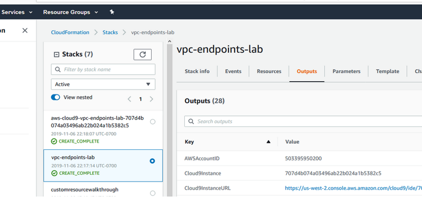
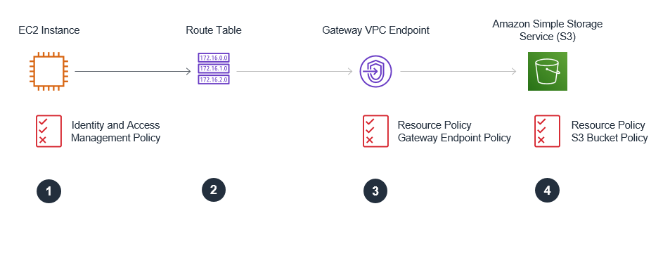

# Environment Setup  

v2.50

# Lab Setup

<details>
  <summary>Using Event Engine</summary>
  
If you are completing this lab using AWS Event Engine, then use the Event Engine Dashboard URL and the Hash provided by the person leading the session in order to access the AWS account you will use for this lab

Once you have accessed the AWS Console for your account, validate that the CloudFormation stacks executed on your behalf by Event Engine used to setup the lab completed successfully at: 

https://us-east-1.console.aws.amazon.com/cloudformation/home?region=us-east-1#/stacks

Verify that all stacks have been provisioned with a status of **CREATE_COMPLETE** 

**Important:**  URL references in this document assume that AWS region us-east-1 is being used.  The AWS region referenced in URLs and used in the screenshots/diagrams below may differ from the region you are using for your lab.  If you are unsure which region your lab should be run in, then please ask the person leading the session.  CloudFormation stack names will be different.  

</details>

<details>
  <summary>Using Your Own AWS Account</summary>

Once you have accessed the AWS Console for your account, validate that the CloudFormation stacks executed on your behalf by Event Engine used to setup the lab completed successfully at: 

https://us-east-1.console.aws.amazon.com/cloudformation/home?region=us-east-1#/stacks

Verify that all stacks have been provisioned with a status of **CREATE_COMPLETE** 

**Important:**  URL references in this document assume that AWS region us-east-1 is being used.  It is recommended that you use region us-east-1 for this lab.  CloudFormation stack names will be different.  It is assumed that if you using an identity with **Administrative level privileges** if you are running this lab in your own AWS account (an account provisioned outside of the Event Engine platform). 

</details>
 

## Lab scenario

You are a security engineer on a team responsible for applications hosted in AWS.  You have been asked to help your company’s software development team implement a solution to securely share data between a sales application and a reports engine.  The CEO has asked the development team to create a dashboard report using sales and compensation data.  

Your CEO has mandated that sales data in transit should not be on the Internet.  She has asked that you work with the development team to demonstrate that extracted sales data is encrypted in transit and that data is transmitted across private network segments only.  The development team has begun building a lab environment inside an Amazon Virtual Private Cloud (VPC), but now need your assistance securing the setup further.  You plan to meet this requirement by using VPC Endpoints. 

1.	The sales application will write daily sales summarizations to Amazon Simple Storage Service (S3) and then update multiple backend compensation systems.   

2.	Once data is placed on S3 and all backend system updates are completed by the sales application, it will place a message onto an Amazon Simple Queue Service (SQS) queue, triggering downstream report generation and SQS message deletion by the reports engine.  

 

3.	The Reports Engine will read messages placed onto an Amazon SQS queue and generate a report
4.	The Reports Engine will then write the output to S3 and delete the processed SQS message  

 

## Connect to Cloud9 IDE and setup SSH

Connect from your client machine into the VPC lab environment using an AWS Cloud9 EC2 instance:  

AWS Cloud9 is a cloud-based integrated development environment (IDE) that lets you write, run, and debug code with just a browser. The execution environment for this Cloud9 environment is an EC2 instance in a public subnet in the lab VPC.  Cloud9 includes a code editor, debugger, and terminal.  You will use the Cloud9 terminal to reach the sales application and reports engine EC2 instances hosted on private subnets in the lab VPC to validate the desired security configuration.   

1.	Access the Cloud9 console: 

https://console.aws.amazon.com/cloud9/home?region=us-east-1

Note:  This URL references us-east-1.  The URL you may need to use may differ if you are running this lab in a region other than us-east-1.  

2.	Click on the “Open IDE” button on the Cloud9 instance.  The IDE loads in your browser.  Note; in event engine your Cloud9 environment may have a different name than is shown in the screenshots below.

 

You have completed the following connection:

 

4.	Use the Window drop down menu in the Cloud9 IDE menu bar to open a new terminal.  A terminal window/tab will open in the Cloud9 pane. **Repeat this process so that you have 3 terminal tabs available in your Cloud9 IDE.**
5.  Use the first terminal tab to retain a connection to the Cloud9 instance.  We will use the other two tabs to make SSH connections to the Sales App EC2 instance and the Reports Engine EC2 instance.  

 

6.   Let's setup SSH configuration on the Cloud9 instance using the first terminal tab.  Run these commands from the Cloud9 instance: 

``` json
aws s3 cp s3://ee-assets-prod-us-east-1/modules/7dbaeba0ef084e64a3566ebed6cb8bd2/v1/prepcloud9forssh.sh ./prepcloud9forssh.sh; chmod 700 prepcloud9forssh.sh; ./prepcloud9forssh.sh
``` 

Output from the shell commands should look as follows:

 

6.  As directed in the output, run the following ssh command to connect to the Sales App EC2 instance running in a private subnet in the VPC

``` json 
ssh ec2-user@salesapp -i vpce.pem
```  

Output from making the SSH connection to the Sales App should look as follows:

 

7.  Open a second terminal in Cloud 9 (Repeat step 4 of the 'Connect to Cloud9 IDE and setup SSH' instructions).  In the second terminal tab establish a connection to the Reports Engine EC2 instance running in a private subnet in the VPC by running the following command: 
 
``` json   
ssh ec2-user@reportsengine -i vpce.pem
```    

Output from making the SSH connection to the Reports Engine should look as follows: 

 

Leave the tab with the SSH connection to the Reports Engine EC2 instance.  We will return to this tab to perform testing later.

## Collect outputs from completed CloudFormation stack 

1.	Access the CloudFormation stacks in your event engine account: 

https://us-east-1.console.aws.amazon.com/cloudformation/home?region=us-east-1#/stacks

Note:  This URL references us-east-1.  The URL you may need to use may differ if you are running this lab in a region other than us-east-1.  

2.	During this lab you will use outputs from the CloudFormation stacks used to setup the lab environment. Event engine will have created two Cloudformation stacks. One of the stacks created the Cloud9 instance - it will have aws-cloud9 in the stack name.  Additional lab components (VPC, SQS Queue, etc) were created by the second CloudFormation stack.  You will refer back to output values from this stack during this lab.  Note - the CloudFormation stack names may differ in your event engine account than those shown the screenshots in the lab documentation.

 

# Build 

You will now examine/update configurations to control access to resources and ensure data is transmitted on private network segments

## Securing Access to the S3 Bucket using a Gateway Endpoint - Overview

 

* **Part 1. Gateway Endpoint - IAM Roles**.  The EC2 instances will use an IAM Role with associated IAM policies which provide permissions to execute API calls against S3.  [See IAM roles for EC2 instances for more information.](https://aws.amazon.com/blogs/aws/iam-roles-for-ec2-instances-simplified-secure-access-to-aws-service-apis-from-ec2/)  
* **Part 2. Gateway Endpoint - Route Tables**.  Routes to the gateway endpoint are placed in the route tables for the private subnets only.  API calls issued from the Cloud9 instance (on the public subnet) will use a route table without an entry that routes traffic to the S3 gateway endpoint.  Consequently, traffic destined for S3 IP addresses that originates on the Cloud9 instance will exit the VPC via the Internet Gateway and traverse the Internet.  API calls issued from the sales application and report engine E2 instances (on the private subnet) will use a route table entry that routes traffic to the gateway endpoint to access S3.
* **Part 3. Gateway Endpoint – Gateway Endpoint Resource Policy**.  You will use a gateway endpoint policy to restrict which S3 buckets can be accessed via the gateway.   
* **Part 4. Gateway Endpoint – S3 Bucket Resource Policy**.  You will use a resource policy (an S3 bucket policy) to require  that all s3:PutObject API calls (used to write data) occur via the Gateway VPC Endpoint.  This will ensure that the data written to this bucket occurs across a private network segment.   

## Part 1: Gateway Endpoint - IAM Roles

You will now review the IAM policies in use by the lab EC2 instances  

 


The Sales App IAM Role and Policy

1.	Access the salesapp role at the following URL: 

https://console.aws.amazon.com/iam/home?region=us-east-1#/roles.  

The role will be named with the cloudFormation stack name, followed by the region it was created in, followed by the string 'salesapp-role'.

2.	Expand the attached policies to review permissions.  Notice 

# The salesapp role has read and write access to both the restricted and the unrestricted buckets.   It will use the "s3:GetObject" API call to write data into the restricted S3 bucket. 
# The salesapp role has permissions on the SQS queue, including read and write access.  It will use the "sqs:SendMessage" API call to write a message on the Queue and indicate data for the sales report has been written into the restricted S3 bucket.

3.	Review the trust policy by clicking on the Trust tab.  Notice that the identity provider(s) ec2.amazonaws.com is a trusted entity.  This trust policy allows the sales app EC2 instance to use the role.

The Reports Engine IAM Role and Policy

1.	Access the reportsengine role at the following URL: https://console.aws.amazon.com/iam/home?region=us-east-1#/roles.  The role will be named with the cloudFormation stack name, followed by the region it was created in, followed by the string 'reportsengine-role'.
2.	Expand the attached policies to review permissions.  Notice that the reportsengine role provides full access to the unrestricted bucket.  It has read/write access to the restricted bucket.  It has permissions on the SQS queue, including the ability to read and delete SQS messages from the SQS Queue.  The reportengine will use the "sqs:ReceiveMessage" API call in order to retrieves messages from the specified queue. The messages will contain the name of the data fil from which the report must be created.  The reportengine will use the "sqs:DeleteMessage" API call in order to delete messages once report generation is complete.    
3.	Review the trust policy by clicking on the Trust tab.  Notice that the identity provider(s) ec2.amazonaws.com is a trusted entity.  This trust policy allows the sales app EC2 instance to use the role

## Part 2: Gateway Endpoint - Route Tables

You will now review the Route Tables in use by the lab EC2 instances

 

1.  Collect the output values from your CloudFormation stack for PrivateSubnet1ARouteTable and PrivateSubnet2ARouteTable.  These are the route tables associated to your private subnets and affect the routing behavior of your EC2 instances; Sales App and Reports Engine.
2.  Access the Route table screen in the VPC dashboard in the AWS console at the following URL: https://us-east-1.console.aws.amazon.com/vpc/home?region=us-east-1#RouteTables:sort=routeTableId
3.  Highlight one of the route tables and examine the route table entries.  Note that a prefix list (format pl-xxx) entry has been populated in the route table and its target is the gateway vpc endpoint.  This entry is automatically populated by AWS when a gateway endpoint is created and associated with a subnet. 

 

## Part 3: Gateway Endpoint – Gateway Endpoint Resource Policy

You will now configure the Gateway Endpoint Resource Policy restricting which S3 buckets can be accessed via the gateway endpoint

 

1.	Access the Endpoints screen in the VPC dashboard in the AWS console: https://us-east-1.console.aws.amazon.com/vpc/home?region=us-east-1#Endpoints:sort=vpcEndpointId
2.	Refer to the collected output values from your CloudFormation.  Note the value of the “S3VPCGatewayEndpoint” output.  This is your VPC Gateway Endpoint ID.
3.	Select your S3 Gateway Endpoint ID in the upper pane of the AWS console.  Details for the endpoint are presented in the lower pane.  Click on the Policy tab.  Click “Edit Policy” to edit the policy.  Click the custom radio button so that you can enter a custom policy.

 

Resource policy - Gateway Endpoint policy template/example    

``` json
{
  "Statement": [
    {
      "Sid": "Access-to-specific-bucket-only",
      "Principal": "*",
      "Action": [
        "s3:GetObject",
        "s3:PutObject"
      ],
      "Effect": "Allow",
      "Resource": ["arn:aws:s3:::examplerestrictedbucketname",
                   "arn:aws:s3:::examplerestrictedbucketname/*"]
    }
  ]
}	
```

Using the endpoint policy template/example above, update the endpoint policy:

5.	Refer to the collected output values from your CloudFormation.  Copy/paste the value of the “RestrictedS3BucketName” output and use it to replace the value of examplerestrictedbucketname in the template/example above and save the custom policy.

  

## Part 4: Gateway Endpoint – S3 Bucket Resource Policy 

You will now configure the S3 Bucket Policy restricting use of the S3 bucket resource

 

Update the S3 Bucket policy in your lab (a template/example is provided below):

1.	Refer to the collected output values from your CloudFormation.  Copy/paste the value of the “RestrictedS3BucketPermsURL” output into a browser to review the permissions on the S3 bucket.  From the permissions tab, click on bucket policy.
2.	Refer to the collected output values from your CloudFormation.  Copy/paste the value of the “RestrictedS3BucketName” output 
3.	Replace the placeholder bucket name “examplerestrictedbucketname” in the template/example with the value of “RestrictedS3BucketName” collected from the CloudFormation outputs
4.	Refer to the collected output values from your CloudFormation.  Copy/paste the value of the “S3VPCGatewayEndpoint” output 
5.	Replace the placeholder “vpce-vpceid” string in the template/example with the value of “S3VPCGatewayEndpoint” collected from the CloudFormation outputs (format will be vpce-xxxxx)
6.	Having updated the example policy (below) with values for your specific resources, add the bucket policy to the S3 bucket.   For additional instructions/clarifications to update the bucket policy see “How do I add an S3 bucket policy?” 


Resource policy - S3 bucket policy template/example 

``` json
 {
   "Version": "2012-10-17",
   "Id": "vpc-endpoints-lab-s3-bucketpolicy",
   "Statement": [
     {
       "Sid": "Access-to-put-objects-via-specific-VPCE-only",
       "Principal": "*",
       "Action": "s3:PutObject",
       "Effect": "Deny",
       "Resource": ["arn:aws:s3:::examplerestrictedbucketname",
                    "arn:aws:s3:::examplerestrictedbucketname/*"],
       "Condition": {
         "StringNotEquals": {
           "aws:sourceVpce": "vpce-vpceid"
         }
       }
     }   
   ]
}

```

7. Enable default encryption on your S3 bucket to ensure that all objects are encrypted at rest.  Amazon S3 default encryption provides a way to set the default encryption behavior for an S3 bucket. You can set default encryption on a bucket so that all new objects are encrypted when they are stored in the bucket. Access the Properties tab of your restricted S3 bucket.  Access the 'Default Encryption' Pane and choose the AWS-KMS (Use Server-Side Encryption with AWS KMS-Managed Keys (SSE-KMS)) radio button. Select the 'aws/s3' AWS-managed KMS key as your default encryption key.   

---


## Securing Access to the SQS Queue using a Interface Endpoint - Overview

  

* **Part 1. Interface Endpoint - IAM Roles**.  The EC2 instances will use an IAM Role with associated IAM policies which provide permissions to execute API calls against SQS.  [See IAM roles for EC2 instances for more information.](https://aws.amazon.com/blogs/aws/iam-roles-for-ec2-instances-simplified-secure-access-to-aws-service-apis-from-ec2/)
* **Part 2. Interface Endpoint - Interface Endpoint Resource Policy**.  Access to the SQS service will be restricted by an Interface Endpoint policy which allows access to a specific queue only and to IAM Principals within the lab AWS only.      
* **Part 3. Interface Endpoint - Security Groups**.  You will restrict network access to the SQS Interface VPC endpoint using security groups.  The security group rules will only allow inbound access from members of the security group used by the Sales application. 
* **Part 4. Interface Endpoint - SQS Queue Resource Policy**. Access to complete sqs:SendMessage, sqs:RecieveMessage or sqs:DeleteMessage API calls will be restricted by a resource policy (an Amazon SQS policy) that requires all messages written to the SQS queue are written via the specified VPC endpoint.

## Part 1: Interface Endpoint - IAM Roles

  

(Optional) Review the IAM permissions in your lab:

1.  Revisit (if required) the IAM permissions assigned to the Sales App and Reports Engine EC2 instances as covered during the section 'Part 1: Gateway Endpoint IAM Roles'.  Each EC2 instance has the required permissions to S3 and SQS.

## Part 2. Interface Endpoint - Security Groups

  

Review the security group configuration in your lab:

1.	Refer to the collected output values from your CloudFormation stack.  Note the value of the “InterfaceSecurityGroupURL” output.  This is the URL to review the security group associated with your interface endpoint.
2.	Paste the value in your browser and select the security group in the top pane.
3.	Click on the Inbound tab in the lower ne to see inbound security group rules.  The development team have restricted access to 10.0.0.0/8.
4.	(Optional).  Further restrict the inbound rules.  Inbound rules could be reference the security groups associated to the sales app and the reports engine EC2 instances or reference the CIDR ranges of the private subnets only to constrain network access to the interface endpoint and the SQS queue it provides access to - https://docs.aws.amazon.com/vpc/latest/userguide/VPC_SecurityGroups.html#AddRemoveRules

  

## Part 3. Interface Endpoint - Interface Endpoint Resource Policy 

  

A VPC Interface policy controls access to an Interface endpoint.  We will use it to restrict access to identities that exist within this AWS account only.

Update the Interface Endpoint policy in your lab (an template/example is provided below):

1. Refer to the collected output values from your CloudFormation stack.  Note the value of the “SQSQueueARN” output.  This is your SQS Queue ARN.
2. Replace the placeholder value “examplequeueARN” with the SQSQueueARN value
3. Refer to the collected output values from your CloudFormation stack.  Note the value of the “AWSAccountID” output.  This is the AWS Account ID being used for this lab.
4. Replace the placeholder value “exampleaccountid” with the AWS Account ID value
5. Save and close.

Resource policy - Interface Endpoint policy template/example     

``` json
{
   "Statement": [{
      "Action": ["sqs:SendMessage"],
      "Effect": "Allow",
      "Resource": "examplequeueARN",
      "Principal": {
        "AWS": "exampleaccountid"
      }
   }]
}	
``` 

## Part 4. Interface Endpoint - SQS Queue Resource Policy  

 

1.	Access the SQS Console in your browser at https://console.aws.amazon.com/sqs/home?region=us-east-1#
2.	Refer to the collected output values from your CloudFormation stack.  Note the value of the “SQSQueueName” output.  This is your SQS Queue.
3.	Select your SQS Queue in the upper pane of the AWS console.  Details for the endpoint are presented in the lower pane.  
4.	In the lower main pane, select the tab titled “Permissions” and then click on “Edit Policy Document (Advanced)”.  A popup window appears..

Update the SQS policy in your lab (a template/example is provided below):

5.  Refer to the collected output values from your CloudFormation stack.  Note the value of the “SQSQueueARN” output.  This is your SQS Queue ARN.
6.  Replace the placeholder value “sqsexampleARN” with the queue ARN for the queue created during CloudFormation lab setup and captured from the outputs table (format will be arn:aws:sqs:<region>:exampleacctid:examplequeuename)
7.  Refer to the collected output values from your CloudFormation stack.  Note the value of the “SQSVPCInterfaceEndpoint” output.  This is your Interface VPC Endpoint.
8.  Replace the example vpcid string “vpce-vpceid” with the ID of the Interface VPC endpoint created during CloudFormation lab setup and captured from the outputs table (format will be vpce-xxxxx)
9.  Having updated the example policy (below) with values for your resources, update the SQS queue resource policy in the popup window...   
10. Click review changes.  Click Save Changes. The queue with updated resource policy will display in the console..

Resource policy - SQS Queue resource policy template/example    

``` json
 {
  "Version": "2012-10-17",
  "Id": "vpc-endpoints-lab-sqs-queue-resource-policy",
  "Statement": [
    {
      "Sid": "all-messages-sent-from-interface-vpc-endpoint",
      "Effect": "Allow",
      "Principal": "*",
      "Action": "sqs:SendMessage",
      "Resource": "sqsexampleARN",
      "Condition": {
        "StringEquals": {
          "aws:sourceVpce": "vpce-vpceid"
        }
      }
    },
    {
      "Sid": "all-messages-received-from-interface-vpc-endpoint",
      "Effect": "Allow",
      "Principal": "*",
      "Action": "sqs:ReceiveMessage",
      "Resource": "sqsexampleARN",
      "Condition": {
        "StringEquals": {
          "aws:sourceVpce": "vpce-vpceid"
        }
      }
    },
    {
      "Sid": "all-messages-deleted-from-interface-vpc-endpoint",
      "Effect": "Allow",
      "Principal": "*",
      "Action": "sqs:DeleteMessage",
      "Resource": "sqsexampleARN",
      "Condition": {
        "StringEquals": {
          "aws:sourceVpce": "vpce-vpceid"
        }
      }
    }

  ]
} 
```

---

**Congratulations !!!**  You can now move on to the [**Verify**](./verify.md) phase!