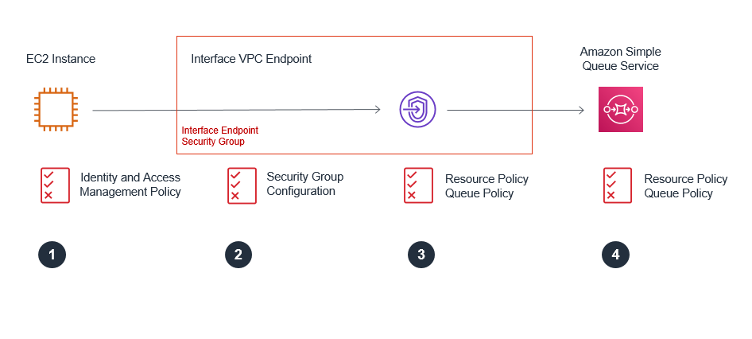
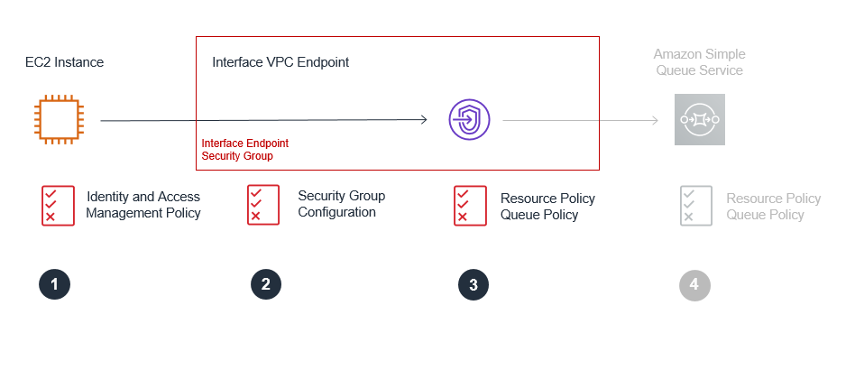

# Build - Interface Endpoint

## Securing Access to the SQS Queue using a Interface Endpoint - Overview

  

* **Part 1. Interface Endpoint - IAM Roles**.  The EC2 instances will use an IAM Role with associated IAM policies which provide permissions to execute API calls against SQS.  [See IAM roles for EC2 instances for more information.](https://aws.amazon.com/blogs/aws/iam-roles-for-ec2-instances-simplified-secure-access-to-aws-service-apis-from-ec2/)
* **Part 2. Interface Endpoint - Interface Endpoint Resource Policy**.  Access to the SQS service will be restricted by an Interface Endpoint policy which allows access to a specific queue only and to IAM Principals within the lab AWS only.      
* **Part 3. Interface Endpoint - Security Groups**.  You will restrict network access to the SQS Interface VPC endpoint using security groups.  The security group rules will only allow inbound access from members of the security group used by the Sales application. 
* **Part 4. Interface Endpoint - SQS Queue Resource Policy**. Access to complete sqs:SendMessage, sqs:RecieveMessage or sqs:DeleteMessage API calls will be restricted by a resource policy (an Amazon SQS policy) that requires all messages written to the SQS queue are written via the specified VPC endpoint.

## Part 1: Interface Endpoint - IAM Roles

  

(Optional) Review the IAM permissions in your lab:

1.  Revisit (if required) the IAM permissions assigned to the Sales App and Reports Engine EC2 instances as covered during the section 'Part 1: Gateway Endpoint IAM Roles'.  Each EC2 instance has the required permissions to S3 and SQS.

## Part 2. Interface Endpoint - Security Groups

  

Review the security group configuration in your lab:

1.	Refer to the collected output values from your CloudFormation stack.  Note the value of the “InterfaceSecurityGroupURL” output.  This is the URL to review the security group associated with your interface endpoint.
2.	Paste the value in your browser and select the security group in the top pane.
3.	Click on the Inbound tab in the lower ne to see inbound security group rules.  The development team have restricted access to 10.0.0.0/8.
4.	(Optional).  Further restrict the inbound rules.  Inbound rules could be reference the security groups associated to the sales app and the reports engine EC2 instances or reference the CIDR ranges of the private subnets only to constrain network access to the interface endpoint and the SQS queue it provides access to - https://docs.aws.amazon.com/vpc/latest/userguide/VPC_SecurityGroups.html#AddRemoveRules

  

## Part 3. Interface Endpoint - Interface Endpoint Resource Policy 

  

A VPC Interface policy controls access to an Interface endpoint.  We will use it to restrict access to identities that exist within this AWS account only.

Update the Interface Endpoint policy in your lab (an template/example is provided below):

1. Refer to the collected output values from your CloudFormation stack.  Note the value of the “SQSQueueARN” output.  This is your SQS Queue ARN.
2. Replace the placeholder value “examplequeueARN” with the SQSQueueARN value
3. Refer to the collected output values from your CloudFormation stack.  Note the value of the “AWSAccountID” output.  This is the AWS Account ID being used for this lab.
4. Replace the placeholder value “exampleaccountid” with the AWS Account ID value
5. Save and close.

Resource policy - Interface Endpoint policy template/example     

``` json
{
   "Statement": [{
      "Action": ["sqs:SendMessage"],
      "Effect": "Allow",
      "Resource": "examplequeueARN",
      "Principal": {
        "AWS": "exampleaccountid"
      }
   }]
}	
``` 

## Part 4. Interface Endpoint - SQS Queue Resource Policy  

 

1.	Access the SQS Console in your browser at https://console.aws.amazon.com/sqs/home?region=us-east-1#
2.	Refer to the collected output values from your CloudFormation stack.  Note the value of the “SQSQueueName” output.  This is your SQS Queue.
3.	Select your SQS Queue in the upper pane of the AWS console.  Details for the endpoint are presented in the lower pane.  
4.	In the lower main pane, select the tab titled “Permissions” and then click on “Edit Policy Document (Advanced)”.  A popup window appears..

Update the SQS policy in your lab (a template/example is provided below):

5.  Refer to the collected output values from your CloudFormation stack.  Note the value of the “SQSQueueARN” output.  This is your SQS Queue ARN.
6.  Replace the placeholder value “sqsexampleARN” with the queue ARN for the queue created during CloudFormation lab setup and captured from the outputs table (format will be arn:aws:sqs:<region>:exampleacctid:examplequeuename)
7.  Refer to the collected output values from your CloudFormation stack.  Note the value of the “SQSVPCInterfaceEndpoint” output.  This is your Interface VPC Endpoint.
8.  Replace the example vpcid string “vpce-vpceid” with the ID of the Interface VPC endpoint created during CloudFormation lab setup and captured from the outputs table (format will be vpce-xxxxx)
9.  Having updated the example policy (below) with values for your resources, update the SQS queue resource policy in the popup window...   
10. Click review changes.  Click Save Changes. The queue with updated resource policy will display in the console..

Resource policy - SQS Queue resource policy template/example    

``` json
 {
  "Version": "2012-10-17",
  "Id": "vpc-endpoints-lab-sqs-queue-resource-policy",
  "Statement": [
    {
      "Sid": "all-messages-sent-from-interface-vpc-endpoint",
      "Effect": "Allow",
      "Principal": "*",
      "Action": "sqs:SendMessage",
      "Resource": "sqsexampleARN",
      "Condition": {
        "StringEquals": {
          "aws:sourceVpce": "vpce-vpceid"
        }
      }
    },
    {
      "Sid": "all-messages-received-from-interface-vpc-endpoint",
      "Effect": "Allow",
      "Principal": "*",
      "Action": "sqs:ReceiveMessage",
      "Resource": "sqsexampleARN",
      "Condition": {
        "StringEquals": {
          "aws:sourceVpce": "vpce-vpceid"
        }
      }
    },
    {
      "Sid": "all-messages-deleted-from-interface-vpc-endpoint",
      "Effect": "Allow",
      "Principal": "*",
      "Action": "sqs:DeleteMessage",
      "Resource": "sqsexampleARN",
      "Condition": {
        "StringEquals": {
          "aws:sourceVpce": "vpce-vpceid"
        }
      }
    }

  ]
} 
```

---

**Congratulations !!!**  You can now move on to the [**Verify**](./verify.md) phase!