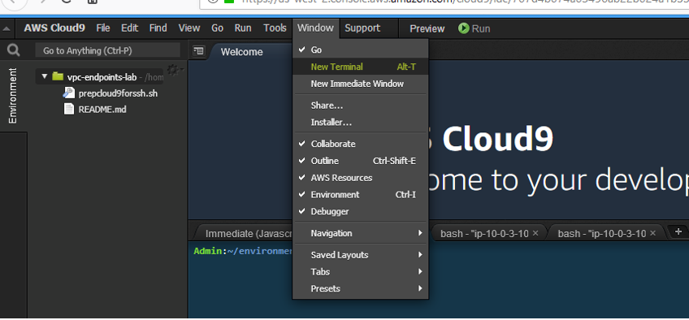
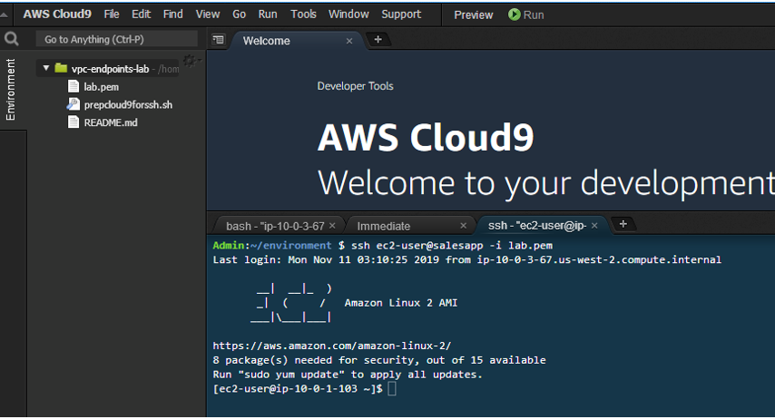
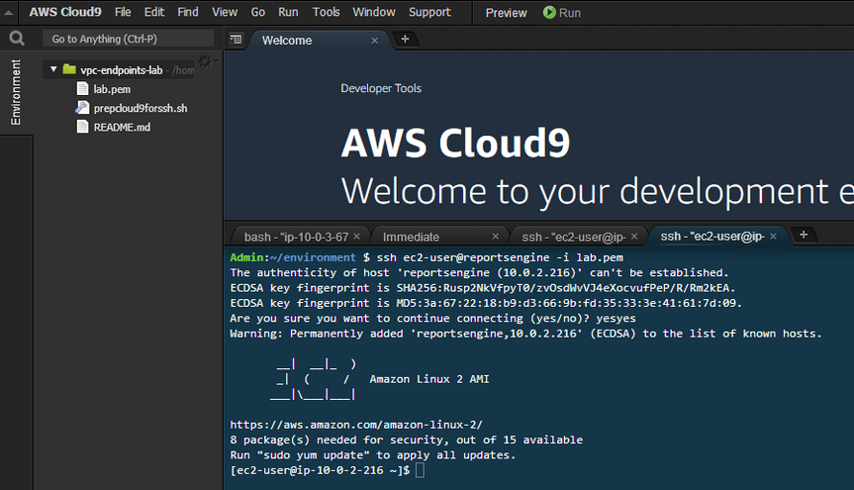

# Environment Setup  

Validate that the CloudFormation stacks used to setup the lab completed successfully at: 

https://us-east-1.console.aws.amazon.com/cloudformation/home?region=us-east-1#/stacks

Verify that all stacks have been provisioned with a status of **CREATE_COMPLETE** 

## Lab scenario

You are a security engineer on a team responsible for applications hosted in AWS.  You have been asked to help your company’s software development team implement a solution to securely share data between a sales application and a reports engine.  The CEO has asked the development team to create a dashboard report using sales and compensation data.  

Your CEO has mandated that sales data in transit should not be on the Internet.  She has asked that you work with the development team to demonstrate that extracted sales data is encrypted in transit and that data is transmitted across private network segments only.  The development team has begun building a lab environment inside an Amazon Virtual Private Cloud (VPC), but now need your assistance securing the setup further.  You plan to meet this requirement by using VPC Endpoints. 

1.	The sales application will write daily sales summarizations to Amazon Simple Storage Service (S3) and then update multiple backend compensation systems.   

2.	Once data is placed on S3 and all backend system updates are completed by the sales application, it will place a message onto an Amazon Simple Queue Service (SQS) queue, triggering downstream report generation and SQS message deletion by the reports engine.  

 

3.	The Reports Engine will read messages placed onto an Amazon SQS queue and generate a report
4.	The Reports Engine will then write the output to S3 and delete the processed SQS message  

  

## Connect to Cloud9 IDE and setup SSH

Connect from your client machine into the VPC lab environment using an AWS Cloud9 EC2 instance:  

AWS Cloud9 is a cloud-based integrated development environment (IDE) that lets you write, run, and debug code with just a browser. The execution environment for this Cloud9 environment is an EC2 instance in a public subnet in the lab VPC.  Cloud9 includes a code editor, debugger, and terminal.  You will use the Cloud9 terminal to reach the sales application and reports engine EC2 instances hosted on private subnets in the lab VPC to validate the desired security configuration.   

1.	Access the Cloud9 console: 

https://console.aws.amazon.com/cloud9/home?region=us-east-1

2.	Click on the “Open IDE” button on the Cloud9 instance.  The IDE loads in your browser.  Note; in event engine your Cloud9 environment may have a different name than is shown in the screenshots below.

 

You have completed the following connection:

  

4.	Use the Window drop down menu in the Cloud9 IDE menu bar to open a new terminal.  A terminal window/tab will open in the Cloud9 pane. **Repeat this process so that you have 3 terminal tabs available in your Cloud9 IDE.**
5.  Use the first terminal tab to retain a connection to the Cloud9 instance.  We will use the other two tabs to make SSH connections to the Sales App EC2 instance and the Reports Engine EC2 instance.  

 

6.   Let's setup SSH configuration on the Cloud9 instance using the first terminal tab.  Run these commands from the Cloud9 instance: 

``` json
aws s3 cp s3://ee-assets-prod-us-east-1/modules/7dbaeba0ef084e64a3566ebed6cb8bd2/v1/prepcloud9forssh.sh ./prepcloud9forssh.sh; chmod 700 prepcloud9forssh.sh; ./prepcloud9forssh.sh
``` 

Output from the shell commands should look as follows:

 

6.  As directed in the output, run the following ssh command to connect to the Sales App EC2 instance running in a private subnet in the VPC

``` json 
ssh ec2-user@salesapp -i vpce.pem
```  

Output from making the SSH connection to the Sales App should look as follows:

 

7.  Open a second terminal in Cloud 9 (Repeat step 4 of the 'Connect to Cloud9 IDE and setup SSH' instructions).  In the second terminal tab establish a connection to the Reports Engine EC2 instance running in a private subnet in the VPC by running the following command: 
 
``` json   
ssh ec2-user@reportsengine -i vpce.pem
```    

Output from making the SSH connection to the Reports Engine should look as follows: 

 

Leave the tab with the SSH connection to the Reports Engine EC2 instance.  We will return to this tab to perform testing later.

## Collect outputs from completed CloudFormation stack 

1.	Access the CloudFormation stacks in your AWS account: 

https://us-east-1.console.aws.amazon.com/cloudformation/home?region=us-east-1#/stacks

2.	During this lab you will use outputs from the CloudFormation stacks used to setup the lab environment. Event engine will have created two Cloudformation stacks. One of the stacks created the Cloud9 instance - it will have aws-cloud9 in the stack name.  Additional lab components (VPC, SQS Queue, etc) were created by the second CloudFormation stack.  You will refer back to output values from this stack during this lab.  Note - the CloudFormation stack names may differ in your event engine account than those shown the screenshots in the lab documentation.


 


**Congratulations !!!**  You can now move on to the [**Build - Gateway Endpoint**](./build-gateway.md) section !