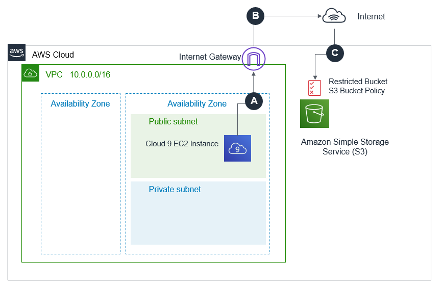
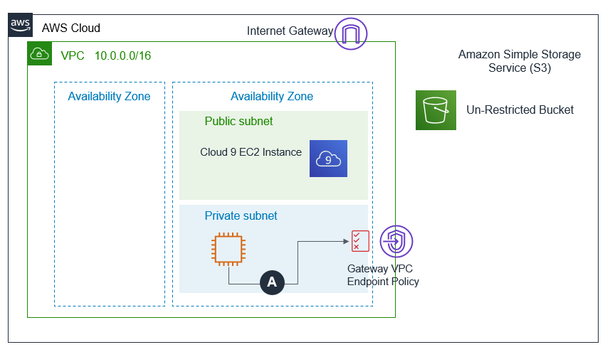

The lab is broken into 4 sections during which you will build and verify Gateway and Interface Endpoints:
* [Section 1: Build-Gateway Endpoint](https://github.com/harrisn6/vpc-endpoints-lab/blob/master/build-gateway.md) 
* [Section 2: Build-Interface Endpoint](https://github.com/harrisn6/vpc-endpoints-lab/blob/master/build-interface.md) 
* Section 3: Verify-Gateway Endpoint
* [Section 4: Verify-Interface Endpoint](https://github.com/harrisn6/vpc-endpoints-lab/blob/master/verify-interface.md) 

You are on Section 3: Verify Gateway

 

# Verify - Gateway Endpoint

**Cloud9 to UnRestricted Bucket**

Verify that Cloud9 can successfully write into the unrestricted bucket (bucket with no bucket policy) via the Internet

1.  Refer to the collected output values from your CloudFormation stack.  Note the value of the "UnrestrictedS3Bucket" output.  You will substitute this value into the commands below.

**Ensure that your session is connected to the Cloud9 instance.  You will execute step 2 from the Cloud9 EC2 instance bash prompt:**
  
2.  Execute the commands provided below AFTER replacing the values of <UnrestrictedS3Bucket> with the output value collected in step 1.  Make note of the results.

``` json
touch test.txt
aws sts get-caller-identity
nslookup s3.amazonaws.com
aws s3 cp test.txt s3://<UnrestrictedS3Bucket>/test.txt
aws s3 rm s3://<UnrestrictedS3Bucket>/test.txt   
```

**Expected behavior** 

The upload to the unrestricted bucket should succeed. 

 


**Why does this work ?**

**A.**  The Cloud9 instance is on the public subnet. When you execute the aws s3 cp command, the AWS CLI signs your API request using credentials associated with the identity returned by the aws sts get-caller-identity.  The AWS CLI uses DNS to resolve the address for Amazon Simple Storage Service(S3).  A public address is returned (as output from the nslookup command shows).  The route table for your Cloud9 instance does not have an entry for the VPC Endpoint and traffic destined for S3 is sent to the Internet Gateway using the 0.0.0.0/0 route table entry.  

**B.**  The request is routed to the public IP address of the S3 service.  

**C.**  The request reaches Amazon S3.  The request is authenticated and the API call is authorized. The unrestricted bucket does not have a resource (bucket) policy. IAM permissions assigned to the identity **ALLOW** data to be written to the unrestricted bucket. 

Note:  If you are using the event engine platform for this lab, the effective identity will be a role named "TeamRole".  This identity has been configured with full access to S3.  If you are running this lab outside of the event engine platform, it is assumed that the identity being used to access Cloud9 has administrative privileges to S3.

 


**Cloud9 to Restricted Bucket**

Verify that attempts to write into the restricted bucket (bucket with a bucket policy) from your Cloud9 instance via the Internet will be **DENIED**

We will now verify the S3 Bucket Policy configuration to validate it meets the stated requirements.  

The S3 bucket policy you added to the restricted bucket (bucket with a bucket policy) enforces the requirement that writes into it occur via the Gateway VPC Endpoint you configured.

1.  Refer to the collected output values from your CloudFormation stack.  Note the value of the "RestrictedS3Bucket" output.  You will substitute this value into the commands below.

**Ensure that your session is connected to the Cloud9 instance.  You will execute step 2 from the Cloud9 EC2 instance bash prompt:**

2. Execute the commands provided below AFTER replacing the values of <RestrictedS3Bucket> with the output values collected in step 1.  Make note of the results.

``` json
touch test.txt
aws sts get-caller-identity
nslookup s3.amazonaws.com
aws s3 cp test.txt s3://<RestrictedS3Bucket>/test.txt
```

**Expected behavior** 

The upload to the restricted bucket will be **DENIED** by the bucket policy

 

**Why does this NOT work ?**

**A.**  The Cloud9 instance is on the public subnet. When you execute the aws s3 cp command, the AWS CLI signs your API request using credentials associated with the identity returned by the aws sts get-caller-identity.  The AWS CLI uses DNS to resolve the address for Amazon Simple Storage Service(S3).  A public address is returned (as output from the nslookup command shows).  The route table for your Cloud9 instance does not have an entry for the VPC Endpoint and traffic destined for S3 is sent to the Internet Gateway using the 0.0.0.0/0 route table entry.  

**B.**  The request is routed to the public IP address of the S3 service.  

**C.**  When the request reaches S3, IAM verifies that the request is authenticated and authorized before completing the request. In this example, the identity signing the request (as seen in output from the aws sts get-caller-identity aws cli command) has permissions to write this object into S3.  IAM permissions assigned to the effective identity **ALLOW** data to be written to the unrestricted bucket. The restricted bucket policy will **DENY** s3:putObject calls, because these will occur over the Internet and not via the S3 Gateway VPC endpoint and the resource policy on the restricted bucket will **DENY** this action. 

Note:  If you are using the event engine platform for this lab, the effective identity will be a role named "TeamRole".  This identity has been configured with full access to S3.  If you are running this lab outside of the event engine platform, it is assumed that the identity being used to access Cloud9 has administrative privileges to S3.

 

The S3 bucket policy you added to the restricted bucket (bucket with a bucket policy) enforces the requirement that writes into Amazon S3 occur via our VPC Endpoint.


**SalesApp EC2 to UnRestricted Bucket**

Verify that attempts to write into the unrestricted bucket (bucket with no bucket policy) from the SalesApp EC2 will via the Gateway VPC Endpoint will be **DENIED**

1.  Refer to the collected output values from your CloudFormation stack.  Note the value of the "UnrestrictedS3Bucket" output.  You will substitute this value into the commands below.

**Ensure that your session is connected to the Sales App EC2 instance.  You will execute step 2 from the Sales App EC2 bash prompt.  If you do not already have a bash session connected to the Sales App EC2 instance execute the following commands from the Cloud9:**

``` json
ssh ec2-user@salesapp -i vpce.pem
```

4.  Execute the commands provided below AFTER replacing the values of <UnrestrictedS3Bucket> with the output value collected in step 1.  Make note of the results.


``` json
touch test.txt
aws sts get-caller-identity
nslookup s3.amazonaws.com
aws s3 cp test.txt s3://<UnrestrictedS3Bucket>/test.txt
```

**Expected behavior When Executed from Sales App EC2 Instance is:** 

Attempts to upload to the unrestricted bucket will be **DENIED**.  The Gateway VPC Endpoint policy will only ALLOW objects to be put into the restricted bucket.

 

**Why does this NOT work ?**

**A.**  The SalesApp instance is on the private subnet. When you execute the aws s3 cp command, the AWS CLI signs your API request using credentials associated with the identity returned by the aws sts get-caller-identity - the salesapprole.   The salesapprole has an IAM policy which authorizes it to perform the S3:putObject API call against both the restricted and unrestricted buckets.  The AWS CLI uses DNS to resolve the address for Amazon Simple Storage Service(S3).  The prefix list entry in the private route table dynamically resolves to the public CIDR ranges used by S3.  The private route table has a prefix list entry for all S3 public IP addresses.  The target for this entry is the Gateway VPC Ednpoint.  This route table entry is more specific than the 0.0.0.0/0 route.  The more specific route takes precedence and traffic for the S3 public IP address space is sent to the S3 Gateway VPC Endpoint.  The S3 Gateway VPC Endpoint Policy will allow access ONLY to the restricted bucket.  Requests that use reference the unrestricted s3 buckett resource fail.

 


* The Sales App EC2 instance sits in a private subnet in your VPC and has a path in its route table to the gateway endpoint.  Calls to S3 are made via the gateway endpoint and access to the bucket occurs over a private network segment. S3:PutObject requests to the unrestricted bucket fail as the gateway endpoint policy will **DENY** access to the unrestricted bucket  


**SalesApp EC2 to Restricted Bucket**

Verify that attempts to write into the restricted bucket (bucket with a bucket policy) from the SalesApp EC2 instance via the Gateway VPC Endpoint will be **ALLOWED**

1.  Refer to the collected output values from your CloudFormation stack.  Note the value of the "RestrictedS3Bucket" output.  You will substitute this value into the commands below.

**Ensure that your session is connected to the Sales App EC2 instance.  You will execute step 2 from the Sales App EC2 bash prompt.  If you do not already have a bash session connected to the Sales App EC2 instance execute the following commands from the Cloud9:**

``` json
ssh ec2-user@salesapp -i vpce.pem
```

2.  Execute the commands provided below AFTER replacing the values of <RestrictedS3Bucket> with the output value collected in step 1.  Make note of the results.


``` json
touch test.txt
aws sts get-caller-identity
nslookup s3.amazonaws.com
aws s3 cp test.txt s3://<restrictedS3Bucket>/test.txt
```

**Expected behavior When Executed from Sales App EC2 Instance is:** 

The upload to the restricted bucket will succeed.  The Gateway VPC Endpoint policy will **ALLOW** objects to be put into the restricted bucket (bucket with a bucket policy).

 

**Why does this work ?**

**A.**  The SalesApp instance is on the private subnet. When you execute the aws s3 cp command, the AWS CLI signs your API request using credentials associated with the identity returned by the aws sts get-caller-identity - the salesapprole.  The salesapprole has an IAM policy which is allowed to perform the S3:putObject API call against both th restricted and unrestricted buckets.  The AWS CLI uses DNS to resolve the address for Amazon Simple Storage Service(S3).  The prefix list entry in the private route table dynamically resolves to the public CIDR ranges used by S3.  The associated target in the private route table for all S3 addresses is the S3 Gateway VPC Endpoint.  This route entry is more specific than a 0.0.0.0/0 route and the more specific route takes precedence.  Traffic destined for an S3public IP address is sent to the S3 Gateway VPC Endpoint.  The request is routed to S3 Gateway VPC Endpoint.  The S3 Gateway VPC Endpoint policy only allows use of the endpoint for access to the restricted bucket.  The resource policy on the restricted S3 bucket denies access to requests which do not use your specific VPC Endpoint (identified by the vpc endpoint id in the policy).  This requirement is met and the request succeeds.

 

---

**Congratulations !!!**  You can now move on to the [**Verify - Interface Endpoint**](./verify-interface.md) section !