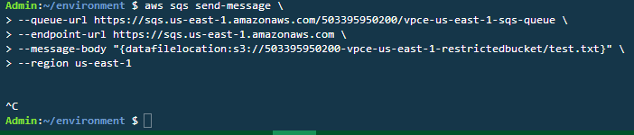
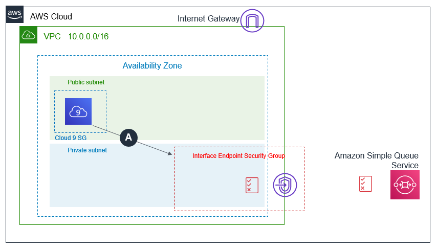

The lab is broken into 4 sections during which you will build and verify Gateway and Interface Endpoints:
* [Section 1: Build-Gateway Endpoint](https://github.com/harrisn6/vpc-endpoints-lab/blob/master/build-gateway.md) 
* [Section 2: Build-Interface Endpoint](https://github.com/harrisn6/vpc-endpoints-lab/blob/master/build-interface.md) 
* [Section 3: Verify-Gateway Endpoint](https://github.com/harrisn6/vpc-endpoints-lab/blob/master/verify-gateway.md) 
* Section 4: Verify-Interface Endpoint 

You are on Section 4: Verify Interface

 

## Verify the Interface Endpoint Configuration 

**Cloud9 to SQSQueue**

Verify that Cloud9 **CANNOT** successfully write into the SQS Queue via the VPC Interface Endpoint due to the Security Group restrictions configured in [Section 2: Build-Interface Endpoint, Part 2 Interface Endpoint - Security Groups ](https://github.com/harrisn6/vpc-endpoints-lab/blob/master/build-interface.md#part-2-interface-endpoint---security-groups). 

1. Refer to the collected output values from your CloudFormation stack.  Note the value of the "SQSQueueURL" and "RestrictedS3Bucket" output.  Also note the AWS Region where your lab is running (e.g. us-east-1).  You will substitute these values into the commands below. 

**Ensure that your session is connected to the Cloud9 instance.  You will execute step 2 from the Cloud9 EC2 instance bash prompt:**
  
2.  Execute the commands provided below AFTER (a) replacing <sqsqueueurlvalue> with the value of the output SQSQueueURL from your Cloudformation stack collected in step 1 (b) replacing <restrictedbucket> with the value of the output restrictedbucket from your Cloudformation stack collected in step 1 and (c) replacing <region> with the value of the region wherer you are executing the lab.  Make note of the results.


``` json
nslookup sqs.<region>.amazonaws.com
aws sts get-caller-identity
aws sqs send-message --queue-url <sqsqueueurlvalue> --endpoint-url https://sqs.<region>.amazonaws.com --message-body "{datafilelocation:s3://<restrictedbucket>/test.txt}" --region <region>
```

**Expected behavior** 

The aws sqs send-message command will not be successful as the VPC Interface Endpoint security group restricts access to the Interface Endpoint.  Network connectivity to SQS is blocked.   

 

Note:  Command displayed above over multiple lines for clarity only.  Control-C used to terminate command execution rather than waiting for timeout.

**Why does this NOT work ?**

When executing the nslookup command, you will observe that the public DNS name for the SQS service returns IP addresses that are from the private IP CIDR within your VPC. 

When you create an interface endpoint, AWS generates endpoint-specific DNS hostnames that you can use to communicate with the service. For AWS services and AWS Marketplace Partner services, private DNS (enabled by default) associates a private hosted zone with your VPC. The hosted zone contains a record set for the default DNS name for the service (for example, ec2.us-east-1.amazonaws.com) that resolves to the private IP addresses of the endpoint network interfaces in your VPC. This enables you to make requests to the service using its default DNS hostname instead of the endpoint-specific DNS hostnames. For example, if your existing applications make requests to an AWS service, they can continue to make requests through the interface endpoint without requiring any configuration changes. For more details see: https://docs.amazonaws.cn/en_us/vpc/latest/userguide/vpce-interface.html#vpce-private-dns

Access the following link to observe each ENI (1 per AZ) used by your Interface Endpoint: (https://us-east-1.console.aws.amazon.com/ec2/home?region=us-east-1#NIC:search=InterfaceSecurity;sort=networkInterfaceId)

The aws sts get-caller-identity command shows the identity being used to sign API requests submitted using the aws cli.  If you are using the event engine platform, this will be a role named "TeamRole".  This role has administrative permissions and can execute all SQS API calls.  If you are executing this lab in your own AWS account.  It is assumed that the identity you are using to access the account has administrative privileges and full access to SQS. 

The aws sqs send-message cli command is execute using an explicit flag (--endpoint-url) to direct commands to the VPC endpoint.  The sqs send-message command will not be successful as the security groups will block network access to the Interface endpoint from the Cloud9 EC2 instance running on a public subnet in your VPC.  The Cloud9 instance is not a member of the security groups assigned to the salesapp or reportsengine.  This can be verified in the EC2 Dashboard.  In US-East-1, the EC2 Dashboard is located at:  https://us-east-1.console.aws.amazon.com/ec2/home?region=us-east-1#Instances:sort=instanceId

 

!!Here!!!

**Ensure that your session is connected to the the Sales App EC2 instance.** 

3. Refer to the collected output values from your CloudFormation stack.  Note the value of the “SQSQueueURL” output.  This is your SQS Queue URL (Queue URL format will be https://sqs.us-east-1.amazonaws.com/exampleaccountid/vpc-endpoints-lab-us-east-1-sqs-queue)
4. While connected to the Sales App EC2 instance, issue the following command to send a message to SQS.  Replace the queue URL placeholder <value> with the corresponding SQSQueueURL key value from your CloudFormation Outputs:
 
``` json
aws sqs send-message --queue-url <value> --message-body "first message" --region us-east-1
```
5.  Read the message back to verify it is in the queue.  A ReceiptHandle value is output.  Copy this value in to your buffer.  
  
``` json
aws sqs receive-message --queue-url <value> --region us-east-1
```

Output from steps 4 and 5 should look like the following:

``` json
aws sqs send-message --queue-url https://sqs.us-east-1.amazonaws.com/503395950200/vpc-endpoints-lab-us-east-1-sqs-queue --message-body "first message" --region us-east-1
{
    "MD5OfMessageBody": "bb3ac257604746ed8f010cf78e39e607", 
    "MessageId": "45061cdf-afcc-47c8-829d-6d7298c00b82"
}
ec2-user@ip-10-0-1-22 $ aws sqs receive-message --queue-url https://sqs.us-east-1.amazonaws.com/503395950200/vpc-endpoints-lab-us-east-1-sqs-queue --region us-east-1
{
    "Messages": [
        {
            "Body": "first message", 
            "ReceiptHandle": "AQEBa4EybzSF7F8O3Udk3wuep+SsVI3fzQ5ThzQbf4WWa+eC38xz5ngIJQ2jnv1kVTeLJ/5Gd2ojJy/lGAvM3JqytXPbExQdFPbSENiVKfjsG2wTLPrRBQOQsbT73+DehZYz/rtVPFo2x22jAdNUL1uuLS93bkrM59/ZCKiZoXEDPNjh2E8LKwigUwcCs3OZkHL18lL01JzjEWLxdGNptTbD/GN5UgfFfV7AFVqBgPPYoLfAEbGIuyPksrWAW3L92GqflEn7AsociFtLYRgw6fdFLEY59qNMthgD2Fg+xnR4mlOWHjYDBojXXaTwNTcq7aSJngFMAbu5LC9L0GZ+HYxyhK1ItESzRUKWOzNKklOjZ58P/21OIgmdcrxnK4UZ5BE0cdp70LfpWgooD0AEflyR2WXAxJ/HDqra6wvLw0juM54=", 
            "MD5OfBody": "bb3ac257604746ed8f010cf78e39e607", 
            "MessageId": "45061cdf-afcc-47c8-829d-6d7298c00b82"
        }
    ]
}
``` 

6.  Attempt to delete the message in the queue using the ReceiptHandle from the receive-message command.  The delete command will fail validating the SQS queue policy enables writing messages into the queue but restricts the role used by the Sales App from deleting messages.

``` json 
aws sqs delete-message --queue-url <value> --region us-east-1 --receipt-handle <receipthandlevalue>
exit
```

``` json
aws sqs delete-message --queue-url https://sqs.us-east-1.amazonaws.com/503395950200/vpc-endpoints-lab-us-east-1-sqs-queue --region us-east-1--receipt-handle "AQEBa4EybzSF7F8O3Udk3wuep+SsVI3fzQ5ThzQbf4WWa+eC38xz5ngIJQ2jnv1kVTeLJ/5Gd2ojJy/lGAvM3JqytXPbExQdFPbSENiVKfjsG2wTLPrRBQOQsbT73+DehZYz/rtVPFo2x22jAdNUL1uuLS93bkrM59/ZCKiZoXEDPNjh2E8LKwigUwcCs3OZkHL18lL01JzjEWLxdGNptTbD/GN5UgfFfV7AFVqBgPPYoLfAEbGIuyPksrWAW3L92GqflEn7AsociFtLYRgw6fdFLEY59qNMthgD2Fg+xnR4mlOWHjYDBojXXaTwNTcq7aSJngFMAbu5LC9L0GZ+HYxyhK1ItESzRUKWOzNKklOjZ58P/21OIgmdcrxnK4UZ5BE0cdp70LfpWgooD0AEflyR2WXAxJ/HDqra6wvLw0juM54="

An error occurred (AccessDenied) when calling the DeleteMessage operation: Access to the resource https://us-east-1.queue.amazonaws.com/ is denied.
```

**Reading Data from SQS via the Interface endpoint from the Reports Engine EC2 instance**

7. In your Cloud9 terminal window, while connected to the Cloud9 EC2 instance execute the following commands.  

``` json
ssh ec2-user@reportsengine -i vpce.pem
aws sqs receive-message --queue-url <value> --region us-east-1
aws sqs delete-message --queue-url <value> --region us-east-1 --receipt-handle <receipthandlevalue>
```

The reports engine EC2 instance can read and delete messages from SQS via the interface endpoint.

**Reading Data from S3 via the Gateway Endpoint**

8.  Refer to the collected output values from your CloudFormation stack.  Note the value of the “RestrictedS3Bucket”.  In your Cloud9 terminal window, while connected to the Reports Engine EC2 instance execute the following commands  

``` json
aws s3 cp s3://<RestrictedS3Bucket>/test.txt  .
exit
```

The reports engine EC2 instance will read data from S3 via the gateway endpoint.