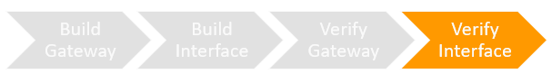

The lab is broken into 4 sections during which you will build and verify Gateway and Interface Endpoints:
* [Section 1: Build-Gateway Endpoint](https://github.com/harrisn6/vpc-endpoints-lab/blob/master/build-gateway.md) 
* [Section 2: Build-Interface Endpoint](https://github.com/harrisn6/vpc-endpoints-lab/blob/master/build-interface.md) 
* [Section 3: Verify-Gateway Endpoint](https://github.com/harrisn6/vpc-endpoints-lab/blob/master/verify-gateway.md) 
* Section 4: Verify-Interface Endpoint 

You are on Section 4: Verify Interface

 


## Verify the Interface Endpoint Configuration 

**Important Note:**  In the Section Build Interface Endpoint.  In 'Build - Interface Endpoint' Part Two Step 4 you had the optional task of restricting the inbound rules from 10.0.0.0/8 to the SQS interface endpoint.  
If you restricted inbound access on this security group, do not complete tests to verify Cloud9 to SQSQueue connectivity - the security group changes that you put in place will restrict network connectivity from the Cloud9 instance to the SQS Interface endpoint. 

**Cloud9 to SQSQueue**

Verify that Cloud9 **CANNOT** successfully write into the SQS Queue via the VPC Interface Endpoint due to the Interface Endpoint Policy. 

1. Refer to the collected output values from your CloudFormation stack.  Note the value of the "SQSQueueURL" and "RestrictedS3Bucket" output.  You will substitute these values into the commands below. 

**Ensure that your session is connected to the Cloud9 instance.  You will execute step 2 from the Cloud9 EC2 instance bash prompt:**
  
2.  Execute the commands provided below AFTER replacing the values of SQSQueueURL and with the output value collected in step 1.  Make note of the results.


``` json
nslookup sqs.us-east-1.amazonaws.com
aws sts get-caller-identity
aws sqs send-message --queue-url <value> --message-body "{datafilelocation:s3://<restrictedbucket>/test.txt}" --region us-east-1
```

**Expected behavior** 

A message will be sent into the SQS Queue 

 


**Why does this work ?**


You will observe that when executing the nslookup command, the public DNS name for the SQS service returns IP addresses that are from the private IP CIDR within your VPC. 

These addresses are the IP addresses used by the interface endpoints provisioned in your lab VPC.  You can view the Elastic Network Interfaces provisioned for your interface endpoint in the EC2 Console under network interfaces.  
This behavior is common across all instances within the VPC, since they all use the private DNS service within the VPC.  You can locate the ENIs being used by the interface endpoints.

Access the following link to observe each ENI (1 per AZ): (https://us-east-1.console.aws.amazon.com/ec2/home?region=us-east-1#NIC:search=InterfaceSecurity;sort=networkInterfaceId)

When you execute the aws sqs send-message command, the AWS CLI signs your API request using credentials associated with the identity returned by the aws sts get-caller-identity.  The AWS CLI uses DNS to resolve the address for Amazon Simple Queue Service(SQS).  A private address is returned (as output from the nslookup command shows).  The route table for your Cloud9 instance uses the local entry for the VPC Interface Endpoint and traffic destined for SQS is sent to the Interface Endpoint.  

Note:  When you create an interface endpoint, AWS generates endpoint-specific DNS hostnames that you can use to communicate with the service. For AWS services and AWS Marketplace Partner services, private DNS (enabled by default) associates a private hosted zone with your VPC. The hosted zone contains a record set for the default DNS name for the service (for example, ec2.us-east-1.amazonaws.com) that resolves to the private IP addresses of the endpoint network interfaces in your VPC. This enables you to make requests to the service using its default DNS hostname instead of the endpoint-specific DNS hostnames. For example, if your existing applications make requests to an AWS service, they can continue to make requests through the interface endpoint without requiring any configuration changes. For more details see: https://docs.amazonaws.cn/en_us/vpc/latest/userguide/vpce-interface.html#vpce-private-dns


!!!!!!!!HERER!!!!!


**Ensure that your session is connected to the the Sales App EC2 instance.** 

3. Refer to the collected output values from your CloudFormation stack.  Note the value of the “SQSQueueURL” output.  This is your SQS Queue URL (Queue URL format will be https://sqs.us-east-1.amazonaws.com/exampleaccountid/vpc-endpoints-lab-us-east-1-sqs-queue)
4. While connected to the Sales App EC2 instance, issue the following command to send a message to SQS.  Replace the queue URL placeholder <value> with the corresponding SQSQueueURL key value from your CloudFormation Outputs:
 
``` json
aws sqs send-message --queue-url <value> --message-body "first message" --region us-east-1
```
5.  Read the message back to verify it is in the queue.  A ReceiptHandle value is output.  Copy this value in to your buffer.  
  
``` json
aws sqs receive-message --queue-url <value> --region us-east-1
```

Output from steps 4 and 5 should look like the following:

``` json
aws sqs send-message --queue-url https://sqs.us-east-1.amazonaws.com/503395950200/vpc-endpoints-lab-us-east-1-sqs-queue --message-body "first message" --region us-east-1
{
    "MD5OfMessageBody": "bb3ac257604746ed8f010cf78e39e607", 
    "MessageId": "45061cdf-afcc-47c8-829d-6d7298c00b82"
}
ec2-user@ip-10-0-1-22 $ aws sqs receive-message --queue-url https://sqs.us-east-1.amazonaws.com/503395950200/vpc-endpoints-lab-us-east-1-sqs-queue --region us-east-1
{
    "Messages": [
        {
            "Body": "first message", 
            "ReceiptHandle": "AQEBa4EybzSF7F8O3Udk3wuep+SsVI3fzQ5ThzQbf4WWa+eC38xz5ngIJQ2jnv1kVTeLJ/5Gd2ojJy/lGAvM3JqytXPbExQdFPbSENiVKfjsG2wTLPrRBQOQsbT73+DehZYz/rtVPFo2x22jAdNUL1uuLS93bkrM59/ZCKiZoXEDPNjh2E8LKwigUwcCs3OZkHL18lL01JzjEWLxdGNptTbD/GN5UgfFfV7AFVqBgPPYoLfAEbGIuyPksrWAW3L92GqflEn7AsociFtLYRgw6fdFLEY59qNMthgD2Fg+xnR4mlOWHjYDBojXXaTwNTcq7aSJngFMAbu5LC9L0GZ+HYxyhK1ItESzRUKWOzNKklOjZ58P/21OIgmdcrxnK4UZ5BE0cdp70LfpWgooD0AEflyR2WXAxJ/HDqra6wvLw0juM54=", 
            "MD5OfBody": "bb3ac257604746ed8f010cf78e39e607", 
            "MessageId": "45061cdf-afcc-47c8-829d-6d7298c00b82"
        }
    ]
}
``` 

6.  Attempt to delete the message in the queue using the ReceiptHandle from the receive-message command.  The delete command will fail validating the SQS queue policy enables writing messages into the queue but restricts the role used by the Sales App from deleting messages.

``` json 
aws sqs delete-message --queue-url <value> --region us-east-1 --receipt-handle <receipthandlevalue>
exit
```

``` json
aws sqs delete-message --queue-url https://sqs.us-east-1.amazonaws.com/503395950200/vpc-endpoints-lab-us-east-1-sqs-queue --region us-east-1--receipt-handle "AQEBa4EybzSF7F8O3Udk3wuep+SsVI3fzQ5ThzQbf4WWa+eC38xz5ngIJQ2jnv1kVTeLJ/5Gd2ojJy/lGAvM3JqytXPbExQdFPbSENiVKfjsG2wTLPrRBQOQsbT73+DehZYz/rtVPFo2x22jAdNUL1uuLS93bkrM59/ZCKiZoXEDPNjh2E8LKwigUwcCs3OZkHL18lL01JzjEWLxdGNptTbD/GN5UgfFfV7AFVqBgPPYoLfAEbGIuyPksrWAW3L92GqflEn7AsociFtLYRgw6fdFLEY59qNMthgD2Fg+xnR4mlOWHjYDBojXXaTwNTcq7aSJngFMAbu5LC9L0GZ+HYxyhK1ItESzRUKWOzNKklOjZ58P/21OIgmdcrxnK4UZ5BE0cdp70LfpWgooD0AEflyR2WXAxJ/HDqra6wvLw0juM54="

An error occurred (AccessDenied) when calling the DeleteMessage operation: Access to the resource https://us-east-1.queue.amazonaws.com/ is denied.
```

**Reading Data from SQS via the Interface endpoint from the Reports Engine EC2 instance**

7. In your Cloud9 terminal window, while connected to the Cloud9 EC2 instance execute the following commands.  

``` json
ssh ec2-user@reportsengine -i vpce.pem
aws sqs receive-message --queue-url <value> --region us-east-1
aws sqs delete-message --queue-url <value> --region us-east-1 --receipt-handle <receipthandlevalue>
```

The reports engine EC2 instance can read and delete messages from SQS via the interface endpoint.

**Reading Data from S3 via the Gateway Endpoint**

8.  Refer to the collected output values from your CloudFormation stack.  Note the value of the “RestrictedS3Bucket”.  In your Cloud9 terminal window, while connected to the Reports Engine EC2 instance execute the following commands  

``` json
aws s3 cp s3://<RestrictedS3Bucket>/test.txt  .
exit
```

The reports engine EC2 instance will read data from S3 via the gateway endpoint.