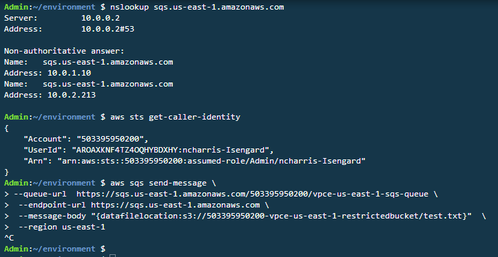

The lab is broken into 4 sections during which you will build and verify Gateway and Interface Endpoints:
* [Section 1: Build-Gateway Endpoint](https://github.com/harrisn6/vpc-endpoints-lab/blob/master/build-gateway.md) 
* [Section 2: Build-Interface Endpoint](https://github.com/harrisn6/vpc-endpoints-lab/blob/master/build-interface.md) 
* [Section 3: Verify-Gateway Endpoint](https://github.com/harrisn6/vpc-endpoints-lab/blob/master/verify-gateway.md) 
* Section 4: Verify-Interface Endpoint 

You are on Section 4: Verify Interface

 

## Verify - Interface Endpoint  

**Cloud9 to SQSQueue**

Verify that Cloud9 cannot write into the SQS Queue via the VPC Interface Endpoint.  This is due to Security Group restrictions configured in [Section 2: Build-Interface Endpoint, Part 2 Interface Endpoint - Security Groups ](https://github.com/harrisn6/vpc-endpoints-lab/blob/master/build-interface.md#part-2-interface-endpoint---security-groups). 

1. Refer to the collected output values from your CloudFormation stack.  Note the value of the "SQSQueueURL" and "RestrictedS3Bucket" output.  Also note the AWS Region where your lab is running (e.g. us-east-1).  You will substitute these values into the commands below. 

**Ensure that your session is connected to the Cloud9 instance.  You will execute step 2 from the Cloud9 EC2 instance bash prompt:**
  
2.  Execute the commands provided below AFTER completing the following.  Make note of the results:
* replacing <sqsqueueurlvalue> with the value of the Cloudformation output **SQSQueueURL** collected in step 1 
* replacing <restrictedbucket> with the value of the Cloudformation output **RestrictedS3Bucket** collected in step 1 
* replacing <region> with the value of the **AWS region** where you are executing the lab

``` json
nslookup sqs.<region>.amazonaws.com
aws sts get-caller-identity
aws sqs send-message --queue-url <sqsqueueurlvalue> --endpoint-url https://sqs.<region>.amazonaws.com --message-body "{datafilelocation:s3://<restrictedbucket>/test.txt}" --region <region>
```

**Expected behavior** 

The aws sqs send-message command cannot use the VPC Interface Endpoint.  Network connectivity to SQS is blocked by security groups that restrict access to the security groups associated to the SalesApp and ReportsEngine.   

 

Note:  Command displayed above over multiple lines for clarity only.  Control-C used to terminate command execution rather than waiting for timeout.

**Why does this NOT work ?**

When executing the nslookup command from within the VPC, you will observe that the public DNS name for the SQS service returns IP addresses that are from the private IP CIDR inside your VPC. Access the following link to observe each ENI (1 per AZ) used by your Interface Endpoint: (https://us-east-1.console.aws.amazon.com/ec2/home?region=us-east-1#NIC:search=InterfaceSecurity;sort=networkInterfaceId)

The aws sts get-caller-identity command shows the identity being used to sign API requests submitted using the aws cli.  If you are using the event engine platform, this will be a role named "TeamRole".  The TeamRole identity has been assigned administrative permissions and can execute all SQS API calls.  If you are executing this lab in your own AWS account.  It is assumed that the identity you are using to access the account has administrative privileges and full access to SQS. 

The aws sqs send-message cli command is executed using an explicit flag (--endpoint-url) to direct the aws cli to explicitly use the VPC endpoint.  The sqs send-message command will not be successful as the security groups will block network access to the Interface endpoint from the Cloud9 EC2 instance running on a public subnet in your VPC.  The Cloud9 instance is not a member of the security groups assigned to the salesapp or reportsengine, which have inbound access to the security group used by the VPC Endpoint and network connectivity from Cloud9 to the endpoint fails.  Security group configuration of the Cloud9 instance can optionally be verified in the EC2 Dashboard.  In US-East-1, the EC2 Dashboard is located at:  https://us-east-1.console.aws.amazon.com/ec2/home?region=us-east-1#Instances:sort=instanceId

 

**SalesApp EC2 to SQSQueue**

Verify that SalesApp EC2 can successfully write into the sqsqueue via the Interface VPC Endpoint

1. Refer to the collected output values from your CloudFormation stack.  Note the value of the "SQSQueueURL" and "RestrictedS3Bucket" output.  Also note the AWS Region where your lab is running (e.g. us-east-1).  You will substitute these values into the commands below. 

**Ensure that your session is connected to the  Sales App EC2 instance.  You will execute step 2 from the Sales App EC2 instance bash prompt.  Execute the following to connect to the SalesApp EC2 instance as needed:**

``` json
ssh ec2-user@salesapp -i vpce.pem

```
  
2.  Execute the commands provided below AFTER completing the following.  Make note of the results:
* replacing <sqsqueueurlvalue> with the value of the Cloudformation output **SQSQueueURL** collected in step 1 
* replacing <restrictedbucket> with the value of the Cloudformation output **RestrictedS3Bucket** collected in step 1 
* replacing <region> with the value of the **AWS region** where you are executing the lab

``` json
nslookup sqs.<region>.amazonaws.com
aws sts get-caller-identity
aws sqs send-message --queue-url <sqsqueueurlvalue> --endpoint-url https://sqs.<region>.amazonaws.com --message-body "{datafilelocation:s3://<restrictedbucket>/test.txt}" --region <region>
```

**Expected behavior** 

The SalesApp EC2 can successfully write into the sqsqueue via the Interface VPC Endpoint

Output from step 2 should look like the following:

 

**Why does this work ?**

**A.**  The AWS CLI signs your API request using credentials associated with the identity returned by the aws sts get-caller-identity - the salesapp role (note: this identity has permissions to execute "sqs:SendMessage" and "sqs:ReceiveMessage" API calls via IAM).  The call is initiated from the SalesApp EC2instance.  There is an inbound rule on the Interface Endpoint security group that allows all TCP inbound access from the security group used by the SalesApp EC2 instance. Network connectivity to the Interface Endpoint is successful.   

**B.**  The Interface Endpoint policy allows "sqs:SendMessage", "sqs:ReceiveMessage" and "sqs:DeleteMessage" API calls to be made by any principal within the AWS account to the vpce-us-east-1-sqs-queue.  The "sqs:SendMessage" API call to the vpce-us-east-1-sqs-queue is permitted by the endpoint policy.

**C.**  The SQS resource policy for the vpce-us-east-1-sqs-queue allows "sqs:SendMessage", "sqs:ReceiveMessage" and "sqs:DeleteMessage" API calls under the condition that they originaite from the source VPC Endpoint.  The condition is met and the request is fulfilled.  

 


3.  Read the message back to verify it is in the queue.  A ReceiptHandle value is output.  Copy this value in to your buffer.  Replace the <region> placeholder in the sample command below with the value of the region where you are executing the lab. 
  
``` json
aws sqs receive-message --queue-url <sqsqueueurlvalue> --endpoint-url https://sqs.<region>.amazonaws.com --region <region>
```

**Expected behavior** 

The SalesApp EC2 can successfully read from the Interface VPC Endpoint

Output from step 3 should look like the following:

 


Recall that SalesApp EC2 role has IAM privileges including "sqs:ListQueues".  We will now validate that the Interface Endpoint Policy (which has a policy that only allows the following API calls: "sqs:SendMessage","sqs:ReceiveMessage","sqs:DeleteMessage") restricts the ability to perform an "sqs:ListQueues" API call.

4.  Attempt to list sqs queues. Replace the <region> placeholder in the sample command below with the value of the region where you are executing the lab.   

``` json 
aws sqs list-queues --region <region> --endpoint-url https://sqs.<region>.amazonaws.com
```

**Expected behavior** 

The SalesApp EC2 cannot successfully list queues via the Interface VPC Endpoint

Output from step 4 should look like the following:

 

**Important!! type exit in order to end your SSH session on the SalesApp EC2 instance and return to the bash/shell prompt on the Cloud9 instance.**

**ReportsEngine EC2 to SQSQueue**

Verify that ReportsEngine EC2 can successfully read and delete messages from the queue via the Interface VPC Endpoint

1. Refer to the collected output values from your CloudFormation stack.  Note the value of the "SQSQueueURL" output.  Also note the AWS Region where your lab is running (e.g. us-east-1).  You will substitute these values into the commands below. 

**Ensure that your session is connected to the ReportsEngine EC2 instance.  You will execute step 2 from the ReportsEngine EC2 instance bash prompt.  Execute the following command to connect to the ReportsEngine EC2 instance, as needed:**

``` json
ssh ec2-user@reportsengine -i vpce.pem

```

2. Execute the commands provided below AFTER (a) replacing <sqsqueueurlvalue> with the value of the output SQSQueueURL from your Cloudformation stack collected in step 1.  Use the  receipt-handle value returned from your first sqs command, replacing <receipthandle> in the second templatesqs command

``` json
nslookup sqs.<region>.amazonaws.com
aws sts get-caller-identity
aws sqs receive-message --queue-url <sqsqueueurlvalue> --endpoint-url https://sqs.<region>.amazonaws.com --region <region> 
aws sqs delete-message --queue-url <sqsqueueurlvalue> --endpoint-url https://sqs.<region>.amazonaws.com --region <region> --receipt-handle <receipthandle>
```

**Expected Behavior:** 

The reports engine EC2 instance can read messages from SQS via the interface endpoint.

 

The reports engine EC2 instance can delete messages from SQS via the interface endpoint.

 


**Why does this work ?**

A. The AWS CLI signs your API request using credentials associated with the identity returned by the aws sts get-caller-identity - the reportsengine role (note: this identity has permissions to execute "sqs:ReceiveMessage" and "sqs:DeleteMessage" API calls via IAM). The call is initiated from the ReportsEngine EC2 instance. There is an inbound rule on the Interface Endpoint security group that allows all TCP inbound access from the security group used by the ReportsEngine EC2 instance. Network connectivity to the Interface Endpoint is successful.

B. The Interface Endpoint policy allows "sqs:SendMessage", "sqs:ReceiveMessage" and "sqs:DeleteMessage" API calls to be made by any principal within the AWS account to the vpce-us-east-1-sqs-queue. The "sqs:ReceiveMessage" API call to the vpce-us-east-1-sqs-queue is permitted by the endpoint policy.

C. The SQS resource policy for the vpce-us-east-1-sqs-queue allows "sqs:SendMessage", "sqs:ReceiveMessage" and "sqs:DeleteMessage" API calls under the condition that they originaite from the source VPC Endpoint. The condition is met and the request is fulfilled.

Note:  The same evaluation process can be applied to the "sqs:DeleteMessage" API call from the ReportsEngine EC2 instance.  It should also be noted that the SalesApp role is not granted "sqs:DeleteMessage" via IAM

 


**ReportsEngine EC2 to S3**

The Reportsengine EC2 instance will read data from S3.

1.  Refer to the collected output values from your CloudFormation stack.  Note the value of the “RestrictedS3Bucket”.  In your Cloud9 terminal window, while connected to the Reports Engine EC2 instance execute the following commands 

**Ensure that your session is connected to the ReportsEngine EC2 instance.  You will execute step 2 from the ReportsEngine EC2 instance bash prompt.  Execute the following command to connect to the ReportsEngine EC2 instance, as needed:**

``` json
ssh ec2-user@reportsengine -i vpce.pem

```

2. Execute the commands provided below AFTER (a) replacing <RestrictedS3Bucket> with the value of the output RestrictedS3Bucket from your Cloudformation stack collected in step 1.    

``` json
nslookup s3.amazonaws.com
aws sts get-caller-identity
aws s3 cp s3://<RestrictedS3Bucket>/test.txt  .
exit
```

**Expected Behavior:** 

The reports engine EC2 instance can read data from the restricted S3 bucket via the Gateway VPC Endpoint.  The Gateway VPC Endpoint policy will **ALLOW** objects to be read from the restricted bucket (bucket with a bucket policy).

**Why does this work ?**

This behavior replicates the access behavior observed during verification of the Gateway Endpoint from the SalesApp EC@ instance. 

Congratulations - you have completed the VPC Endpoint Lab !!  Thank you

**Summary:**

**S3 Gateway Endpoint Verification**

1.  IAM.  The roles used by the SalesApp EC2 instance and ReportsEngine EC2 Instance provided permission to both the S3restricted and unrestricted buckets (this configuration was deployed during lab setup)
2.  Route table entry.  AWS created a route table entry in the route tableassociated with the private subnets (this configuration was deployed during lab setup) 
3.  S3 Gateway Endpoint Resource Policy.  The resource policy was configured to only allow the "s3:GetObject" and "s3:PutObject" API calls.
4.  S3 Bucket Resource Policy.  An S3 Bucket Resource Policy was configured on the restricted bucket.  It used a condition in the policy that denied the "s3:PutObject" API call whenever the required condition of using the VPC Endpoint was unmet.  

**Result:** The effect of this security configuration is that data can only be written in to the restricted S3 bucket via the specific VPC endpoint in the VPC.  Route table entries exist to route traffic from the private subnets to the endpoint.  Only "s3:GetObject" and "s3:PutObject" API calls can be executed via the endpoint.

**SQS Interface Endpoint Verification**

1.  IAM.  The SalesApp role has the permissions to execute "sqs:SendMessage" and "sqs:ReceiveMessage". The ReportsEngine role has the permissions to execute "sqs:ReceiveMessage" and "sqs:DeleteMessage"
2.  Security Groups.  The Interface Endpoint Security Group is used to restrict inbound network access to the SalesApp EC2 instance and ReportsEngine EC2 Instances (based on their security group membership).  Private DNS resolves requests executed within the VPC for the SQS service to private IP address space; specifically the IPs used by the Elastic Network Interfaces (ENIs) provisioned for the Interface Endpoint.   
3.  Interface Endpoint Policy allows the "sqs:SendMessage","sqs:ReceiveMessage" and "sqs:DeleteMessage" API calls to be made to a specific SQS queue by identities within the AWS account only.
4.  SQS Resource Policy.  The SQS Queue Resource Policy allows the "sqs:SendMessage","sqs:ReceiveMessage" and "sqs:DeleteMessage" API calls to be made to a the SQS queue only when they mee the condition of occurring via the Interface Endpoint.

**Result:** The effect of this security configuration is that SQS interactions is that the "sqs:SendMessage","sqs:ReceiveMessage" and "sqs:DeleteMessage" API calls can only occur via the endpoint and access to endpoint is restricted bothby a network control (security group) and by an IAM control (endpoint policy).

**Clean-Up!!**

If you are using your own AWS account for this lab, you will need to access the S3 console and empty thebuckets used in this lab. You can then proceed to delete the Cloudformation stack run to setup the lab. 