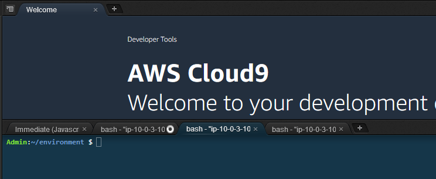

# Verify

We will now verify the configuration to validate it meets the stated requirements.  

## Verify the Gateway Endpoint Configuration

* Verify the Gateway Endpoint Configuration for s3:PutObject and s3:getObject calls to S3
  * Writes to the restricted bucket must use the gateway endpoint.
  * Access to the gateway endpoint is only available to the private subnets via the route tables associated to the private subnets. 

While connected to the Cloud9 instance, you will attempt to write data into restricted bucket and the unrestricted bucket.  The Cloud9 instance is running in your public subnet and has no route to the Gateway endpoint.  Consequently, traffic bound for S3 will traverse the Internet via the Internet Gateway in your lab.  

In your Cloud9 terminal window, open a terminal session.  

 

**Ensure that your session is connected to the Cloud9 instance and not the Sales App or Reports Engine EC2 instances.** 

You will execute steps 1 and 2 from the Cloud9 EC2 instance bash prompt:**

1.  Refer to the collected output values from your CloudFormation stack.  Note the value of the “RestrictedS3Bucket” and "UnrestrictedS3Bucket" outputs.  
2.  Execute the commands provided below AFTER replacing the values of <RestrictedS3Bucket> and <UnrestrictedS3Bucket> with the output values collected in step 1.  Make note of the results.

``` json
touch test.txt
aws s3 cp test.txt s3://<RestrictedS3Bucket>/test.txt
aws s3 cp test.txt s3://<UnrestrictedS3Bucket>/test.txt

aws s3 rm s3://<UnrestrictedS3Bucket>/test.txt   
aws s3 rm s3://<RestrictedS3Bucket>/test.txt     
```

**Expected behavior When Executed from Cloud9 Instance is:** 
* The restricted bucket policy will **DENY** s3:putObject calls, because these will occur over the Internet and not via the endpoint and the resource policy on the restricted bucket will DENY this action. 
* The unrestricted bucket will **ALLOW** s3:putObject calls, because the unrestricted bucket does not have a bucket policy requiring use of the endpoint. 

|Command   |  Executed from Cloud9 EC2 Instance |   
|---|---|
| aws s3 cp test.txt s3://'RestrictedS3Bucket'/test.txt    |  upload failed | 
| aws s3 cp test.txt s3://'UnrestrictedS3Bucket'/test.txt  |  upload |  

3. Connect to the Sales App EC2 instance.  You will now establish an SSH connection to the EC2 Sales App instance running in a private subnet in the lab VPC.  Execute the commands provided below AFTER replacing the values of <RestrictedS3Bucket> and <UnrestrictedS3Bucket> with the output values collected in step 1.  Make note of the results. 

``` json
ssh ec2-user@salesapp -i vpce.pem
```

**Ensure that after completing step #3 your session is connected to the the Sales App EC2 instance.**

``` json
touch test.txt
aws s3 cp test.txt s3://<RestrictedS3Bucket>/test.txt
aws s3 cp test.txt s3://<UnrestrictedS3Bucket>/test.txt
  
```
**Expected behavior When Executed from Cloud9 Instance is:** 
* The Sales App EC2 instance sits in a private subnet in your VPC and has a path in its route table to the gateway endpoint.  Calls to S3 are made via the gateway endpoint and access to the bucket occurs over a private network segment. S3:PutObject requests to the unrestricted bucket fail as the gateway endpoint policy will **DENY** access to the unrestricted bucket  
* Access to the restricted bucket is successful.  

|Command   |   Executed from Sales App EC2 Instance |  
|---|---|
| aws s3 cp test.txt s3://'RestrictedS3Bucket'/test.txt    | upload  |  
| aws s3 cp test.txt s3://'UnrestrictedS3Bucket'/test.txt  | upload failed |

## Verify the Interface Endpoint Configuration 

1. From the Cloud9 EC2 instance, establish an SSH connection to the Sales App EC2 instance running in a private subnet in the lab VPC.   

``` json
ssh ec2-user@salesapp -i vpce.pem
```

2. Execute an nslookup command

``` json
nslookup sqs.us-east-1.amazonaws.com
```

You will observe that when executing the nslookup command, providing the public DNS name for the SQS service returns IP addresses that are from the private IP CIDR within your VPC. 

These addresses are the IP addresses used by the interface endpoints provisioned in your lab VPC.  You can view the Elastic Network Interfaces provisioned for your interface endpoint in the EC2 Console under network interfaces.  
This behavior is common across all instances within the VPC, since they all use the private DNS service within the VPC.  You can locate the ENIs being used by the interface endpoints.

Access the following link to observe each ENI (1 per AZ): (https://us-east-1.console.aws.amazon.com/ec2/home?region=us-east-1#NIC:search=InterfaceSecurity;sort=networkInterfaceId)

**Ensure that your session is connected to the the Sales App EC2 instance.** 

3. Refer to the collected output values from your CloudFormation stack.  Note the value of the “SQSQueueURL” output.  This is your SQS Queue URL (Queue URL format will be https://sqs.us-east-1.amazonaws.com/exampleaccountid/vpc-endpoints-lab-us-east-1-sqs-queue)
4. While connected to the Sales App EC2 instance, issue the following command to send a message to SQS.  Replace the queue URL placeholder <value> with the corresponding SQSQueueURL key value from your CloudFormation Outputs:
 
``` json
aws sqs send-message --queue-url <value> --message-body "first message" --region us-east-1
```
5.  Read the message back to verify it is in the queue.  A ReceiptHandle value is output.  Copy this value in to your buffer.  
  
``` json
aws sqs receive-message --queue-url <value> --region us-east-1
```

Output from steps 4 and 5 should look like the following:

``` json
aws sqs send-message --queue-url https://sqs.us-east-1.amazonaws.com/503395950200/vpc-endpoints-lab-us-east-1-sqs-queue --message-body "first message" --region us-east-1
{
    "MD5OfMessageBody": "bb3ac257604746ed8f010cf78e39e607", 
    "MessageId": "45061cdf-afcc-47c8-829d-6d7298c00b82"
}
ec2-user@ip-10-0-1-22 $ aws sqs receive-message --queue-url https://sqs.us-east-1.amazonaws.com/503395950200/vpc-endpoints-lab-us-east-1-sqs-queue --region us-east-1
{
    "Messages": [
        {
            "Body": "first message", 
            "ReceiptHandle": "AQEBa4EybzSF7F8O3Udk3wuep+SsVI3fzQ5ThzQbf4WWa+eC38xz5ngIJQ2jnv1kVTeLJ/5Gd2ojJy/lGAvM3JqytXPbExQdFPbSENiVKfjsG2wTLPrRBQOQsbT73+DehZYz/rtVPFo2x22jAdNUL1uuLS93bkrM59/ZCKiZoXEDPNjh2E8LKwigUwcCs3OZkHL18lL01JzjEWLxdGNptTbD/GN5UgfFfV7AFVqBgPPYoLfAEbGIuyPksrWAW3L92GqflEn7AsociFtLYRgw6fdFLEY59qNMthgD2Fg+xnR4mlOWHjYDBojXXaTwNTcq7aSJngFMAbu5LC9L0GZ+HYxyhK1ItESzRUKWOzNKklOjZ58P/21OIgmdcrxnK4UZ5BE0cdp70LfpWgooD0AEflyR2WXAxJ/HDqra6wvLw0juM54=", 
            "MD5OfBody": "bb3ac257604746ed8f010cf78e39e607", 
            "MessageId": "45061cdf-afcc-47c8-829d-6d7298c00b82"
        }
    ]
}
``` 

6.  Attempt to delete the message in the queue using the ReceiptHandle from the receive-message command.  The delete command will fail validating the SQS queue policy enables writing messages into the queue but restricts the role used by the Sales App from deleting messages.

``` json 
aws sqs delete-message --queue-url <value> --region us-east-1 --receipt-handle <receipthandlevalue>
exit
```

``` json
aws sqs delete-message --queue-url https://sqs.us-east-1.amazonaws.com/503395950200/vpc-endpoints-lab-us-east-1-sqs-queue --region us-east-1--receipt-handle "AQEBa4EybzSF7F8O3Udk3wuep+SsVI3fzQ5ThzQbf4WWa+eC38xz5ngIJQ2jnv1kVTeLJ/5Gd2ojJy/lGAvM3JqytXPbExQdFPbSENiVKfjsG2wTLPrRBQOQsbT73+DehZYz/rtVPFo2x22jAdNUL1uuLS93bkrM59/ZCKiZoXEDPNjh2E8LKwigUwcCs3OZkHL18lL01JzjEWLxdGNptTbD/GN5UgfFfV7AFVqBgPPYoLfAEbGIuyPksrWAW3L92GqflEn7AsociFtLYRgw6fdFLEY59qNMthgD2Fg+xnR4mlOWHjYDBojXXaTwNTcq7aSJngFMAbu5LC9L0GZ+HYxyhK1ItESzRUKWOzNKklOjZ58P/21OIgmdcrxnK4UZ5BE0cdp70LfpWgooD0AEflyR2WXAxJ/HDqra6wvLw0juM54="

An error occurred (AccessDenied) when calling the DeleteMessage operation: Access to the resource https://us-east-1.queue.amazonaws.com/ is denied.
```

**Reading Data from SQS via the Interface endpoint from the Reports Engine EC2 instance**

7. In your Cloud9 terminal window, while connected to the Cloud9 EC2 instance execute the following commands.  

``` json
ssh ec2-user@reportsengine -i vpce.pem
aws sqs receive-message --queue-url <value> --region us-east-1
aws sqs delete-message --queue-url <value> --region us-east-1 --receipt-handle <receipthandlevalue>
```

The reports engine EC2 instance can read and delete messages from SQS via the interface endpoint.

**Reading Data from S3 via the Gateway Endpoint**

8.  Refer to the collected output values from your CloudFormation stack.  Note the value of the “RestrictedS3Bucket”.  In your Cloud9 terminal window, while connected to the Reports Engine EC2 instance execute the following commands  

``` json
aws s3 cp s3://<RestrictedS3Bucket>/test.txt  .
exit
```

The reports engine EC2 instance will read data from S3 via the gateway endpoint.